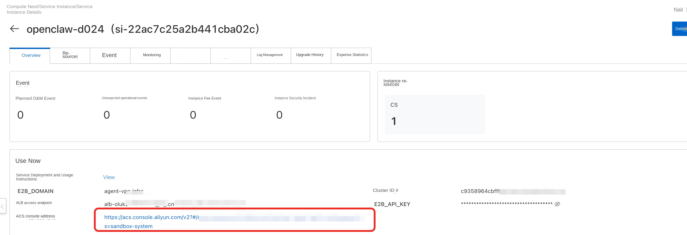
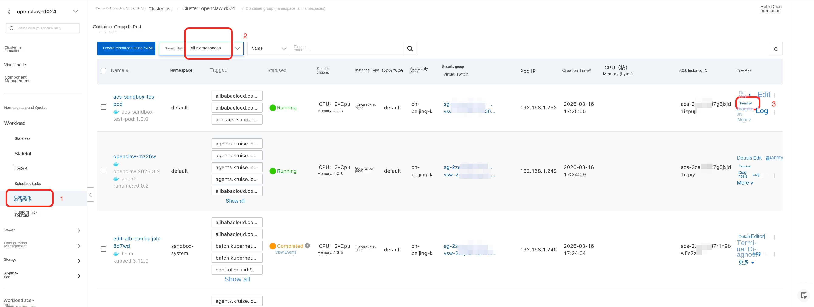
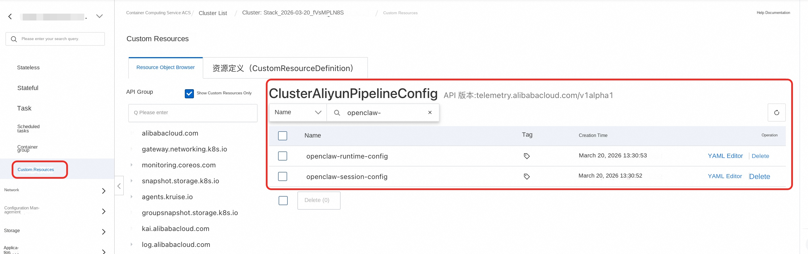
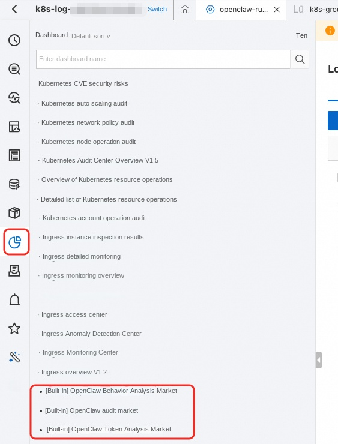

# OpenClaw Enterprise Edition - Production Deployment Guide

This document describes the **Production** deployment scheme for OpenClaw Enterprise Edition. It is applicable to enterprise customers who have strict requirements on network isolation, security, and high availability.

## Overview

Production deployment is based on the **ACK Managed Cluster + VirtualNode (ACS)** architecture and supports **3-AZ high availability** and **Poseidon TrafficPolicy network isolation**.

- **Cluster Type**: ACK Pro managed cluster + VirtualNode (Sandbox Pods run on ACS elastic compute)
- **Node Management**: ECS node pool runs control components (sandbox-manager, etc.); Sandbox Pods scale elastically on demand
- **Network Isolation**: Poseidon TrafficPolicy + Security Group multi-layer isolation
- **High Availability**: 3-AZ deployment, 6 VSwitches (3 for business, 3 for OpenClaw isolation)

### Network Architecture

- **3 Availability Zones**: Cross-AZ high availability deployment
- **6 VSwitches**: 3 business VSwitches + 3 OpenClaw isolation VSwitches
- **Standalone NAT Gateway**: OpenClaw sandboxes use a dedicated NAT Gateway and EIP for outbound traffic
- **ALB Ingress**: ALB load balancer as the ingress gateway
- **PrivateZone**: Wildcard domain name resolution within the VPC

### Network Isolation Policy

Production deployment achieves sandbox network isolation through a multi-layer security policy:

**Layer 1: Enterprise Security Group**

**Layer 2: Poseidon TrafficPolicy**
- Fine-grained network policies at the Kubernetes layer via GlobalTrafficPolicy

**Layer 3: Standalone NAT Gateway**
- OpenClaw sandboxes use a dedicated NAT Gateway and EIP for outbound traffic, completely isolated from business traffic

## Prerequisites

1. Have an Alibaba Cloud account with real-name authentication completed
2. Prepare TLS certificate files (`fullchain.pem` and `privkey.pem`) for HTTPS access to the E2B API
3. Grant permissions to the RAM user:
   If you are using a RAM user, you need to grant the necessary permissions to the RAM user before completing the deployment. Refer to the [authorization documentation](https://help.aliyun.com/zh/compute-nest/security-and-compliance/grant-user-permissions-to-a-ram-user).
   The permission policies required to deploy this service include two system policies and one custom policy. Please ask a user with administrator privileges to grant the following permissions to the RAM user:

   **System Permission Policies:**
   - AliyunComputeNestUserFullAccess: Permissions for managing the Compute Nest service on the user side
   - AliyunROSFullAccess: Permissions to manage the Resource Orchestration Service (ROS)

   **Custom Permission Policy:** [policy_prod.json](https://github.com/aliyun-computenest/openclaw-acs-sandbox/blob/main/docs/policy_prod.json)

### Activate Services
If you have not previously used the related cloud services, you will be prompted to first activate them and create the corresponding service-linked roles during deployment, as shown below.


This step requires relatively high-risk permissions (administrator access to cloud services). We recommend one of the following two approaches:

> Note: Activation is a one-time operation, only required the first time you use the service.

1. Ask an administrator user to open the Compute Nest service deployment link, and let the administrator follow the prompts to activate the services.
2. Ask an administrator user to temporarily grant administrator privileges to the RAM user; once authorized, the RAM user can perform the activation. The required permission policy is as follows:

   Service activation permission policy: [open_policy.json](https://github.com/aliyun-computenest/openclaw-acs-sandbox/blob/main/docs/open_policy.json)

## Deployment Steps

### Step 1: Create a Service Instance

1. Log in to the [Compute Nest Console](https://computenest.console.aliyun.com)
2. Find the **OpenClaw-ACS-Sandbox Cluster Edition** service
3. Click **Create Service Instance**

### Step 2: Select Template

At the top of the creation page, select the **Production Environment** template:

- **Test Environment**: Dual-AZ, suitable for quick verification
- **Production Environment**: 3-AZ high availability with network isolation, suitable for production use. (If you need a dual-AZ production environment, select the "Production Environment - Dual-AZ Edition" template.)

### Step 3: Configure VPC and Availability Zones

| Parameter | Description | Default |
|------|------|--------|
| **Zone 1/2/3** | Select three different availability zones | Choose based on region |
| **Select existing / new VPC** | Create a new VPC or use an existing one | Create new VPC |
| **VPC IPv4 CIDR block** | VPC primary CIDR block | `192.168.0.0/16` |

### Step 4: Configure Control VSwitches

Configure a business VSwitch CIDR block for each of the 3 availability zones, used for cluster nodes and control components. If you select an existing VPC that has an additional CIDR block, use the VSwitch corresponding to the VPC primary CIDR block:

| Parameter | Description | Default |
| ------ | ----------- | -------- |
| **Control VSwitch subnet CIDR 1** | Zone 1 CIDR block | `192.168.0.0/24` |
| **Control VSwitch subnet CIDR 2** | Zone 2 CIDR block | `192.168.1.0/24` |
| **Control VSwitch subnet CIDR 3** | Zone 3 CIDR block | `192.168.2.0/24` |

### Step 5: Configure OpenClaw VSwitches

Configure dedicated VSwitches for OpenClaw sandboxes to achieve physical isolation from the business network:

| Parameter | Description | Default |
| ------ | ------ | -------------------- |
| **OpenClaw dedicated VSwitch CIDR 1** | Zone 1 CIDR block | `192.168.120.0/24` |
| **OpenClaw dedicated VSwitch CIDR 2** | Zone 2 CIDR block | `192.168.121.0/24` |
| **OpenClaw dedicated VSwitch CIDR 3** | Zone 3 CIDR block | `192.168.122.0/24` |

> OpenClaw VSwitches support additional CIDR blocks. The 3 OpenClaw VSwitch CIDR blocks must be different from each other.

### Step 6: Configure Cluster Parameters

| Parameter | Description | Default |
| ------ | ------ | ----------------- |
| **Service CIDR** | Kubernetes Service CIDR block | `172.16.0.0/16` |

> Service CIDR must not overlap with the VPC CIDR or any existing cluster CIDR, and cannot be modified after creation.

### Step 7: Configure Sandbox Parameters

| Parameter | Description | Required | Default |
| ------ | ------ | --------- | ----------------- |
| **Sandbox access domain** | Domain name for accessing the Sandbox API | Has default | `agent-vpc.infra` |
| **TLS Certificate** | `fullchain.pem` certificate file | **Required** | |
| **TLS Certificate Key** | `privkey.pem` private key file | **Required** | |
| **Configure intranet domain resolution** | Automatically create a PrivateZone | Recommended | `true` |
| **PrivateZone creation mode** | Create new or reuse an existing PrivateZone (only shown when ExistingVPC + intranet domain resolution is enabled). If a PrivateZone with the same domain already exists in the VPC, the template will detect it automatically; please select "Reuse existing" | Default new | New |
| **Sandbox API access key** | Key used to access the Sandbox Management API | Optional | Auto-generated |
| **Sandbox Manager CPU** | sandbox-manager CPU resources | Default | `2` |
| **Sandbox Manager Memory** | sandbox-manager memory resources | Default | `4Gi` |
| **Schedule Sandbox Manager to virtual node** | Whether to schedule Sandbox Manager to a virtual node (ACS mode). When enabled, Sandbox Manager runs on a serverless virtual node | Enabled by default | `true` |
| **Specify dedicated VSwitch for ALB** | When enabled, you can specify a dedicated VSwitch for ALB, isolated from cluster node VSwitches (only effective in ExistingVPC scenarios) | Optional | |
| **ALB VSwitch ID (Zone 1)** | Dedicated VSwitch used by ALB in Zone 1; must belong to the same VPC | Optional (required when dedicated VSwitch is enabled) | |
| **ALB VSwitch ID (Zone 2)** | Dedicated VSwitch used by ALB in Zone 2; must belong to the same VPC | Optional (required when dedicated VSwitch is enabled) | |

### Step 8: Configure OpenClaw Parameters

| Parameter | Description | Required |
| ----------------- | ------ | --------- |
| **OpenClaw deployment namespace** | Kubernetes namespace where SandboxSet (OpenClaw Pods) and TestPod reside. `sandbox-manager` is always deployed in the `sandbox-system` namespace and is not affected by this parameter. | Default `default` |

### Step 9: Configure CMS Observability (Optional)

| Parameter | Description | Required |
| ------ | ------ | --------- |
| **Enable CMS Observability** | When enabled, the system automatically integrates with Alibaba Cloud Monitor 2.0 (ARMS APM) to provide distributed tracing and performance monitoring for OpenClaw sandboxes | Disabled by default |
| **CMS Workspace name** | Workspace name of Cloud Monitor 2.0. You can view it in the [ARMS Console](https://arms.console.aliyun.com/) under Environment Management. The system automatically retrieves the required AuthToken and Project info from this Workspace, no manual configuration needed | Required when CMS is enabled |

> 💡 **Note**: After enabling CMS Observability, the system automatically queries Workspace EntryPointInfo (including AuthToken and Project) via `DATASOURCE::CMS2::ServiceObservability` and injects them into the OpenClaw sandbox startup script, so no ARMS-related parameters need to be filled manually.

### Step 10: Confirm and Create

1. Click **Next: Confirm Order**
2. Confirm the configuration parameters and cost
3. Click **Create** to start the deployment

> Deployment takes approximately **15-22 minutes**. Please be patient.

## Deployment Verification

### View Service Instance Status

After deployment completes, on the **Service Instances** page of the Compute Nest console, you will see the instance status change to **Deployed**.

## Automated Testing (no need to configure local environment or domain resolution, suitable for quick verification)

1. Click the Compute Nest service instance to find the ACK cluster contained in the instance.
   
2. On the cluster's container groups page, find `acs-sandbox-test-pod` and click "Terminal" to log in.
   
3. Test creating an OpenClaw sandbox.

   - Configure the following environment variables to set the `GATEWAY_TOKEN` and the `API_KEY` for accessing Bailian (DashScope) for OpenClaw. If you skip this step, the default values are used.
     - Default `GATEWAY_TOKEN`: `clawdbot-mode-123456`
     - Default `DASHSCOPE_API_KEY`: `sk-****`
     - Default Bailian baseUrl (China): `https://dashscope.aliyuncs.com/compatible-mode/v1`
     - Default Bailian baseUrl (International): `https://dashscope-intl.aliyuncs.com/compatible-mode/v1`
     - These values are pre-configured in `openclaw_template.json`.

     ```bash
     export GATEWAY_TOKEN=****
     export DASHSCOPE_API_KEY=****
     ```
   - Run `python create_openclaw.py`
   - Wait for the script to finish and obtain the `SandboxId`. Once the service is ready, OpenClaw has started successfully, and you can access the OpenClaw Web UI of the corresponding sandbox.
4. Test creating, hibernating, and waking up an OpenClaw sandbox.
   - Run `python test_openclaw.py`
5. Wait for the script to verify all functions. When the log shows **"创建 sandbox 耗时" (Time taken to create sandbox)**, the verification has passed.

## SandboxSet Configuration

Example of a production SandboxSet configuration:

```yaml
apiVersion: agents.kruise.io/v1alpha1
kind: SandboxSet
metadata:
  name: openclaw
  namespace: ${SandboxNamespace}
spec:
  persistentContents:
    - filesystem
  replicas: ${OpenClawReplicas}
  runtimes:
    - name: agent-runtime
  template:
    metadata:
      labels:
        app: openclaw
        alibabacloud.com/acs: "true"
      annotations:
        image.alibabacloud.com/enable-image-cache: "true"
        network.alibabacloud.com/vswitch-ids: "${OpenClawVSwitchId1},${OpenClawVSwitchId2},${OpenClawVSwitchId3}"
        network.alibabacloud.com/security-group-ids: "${OpenClawIsolationSecurityGroupId}"
        network.alibabacloud.com/network-policy-mode: "traffic-policy"
        network.alibabacloud.com/enable-network-policy-agent: "true"
    spec:
      automountServiceAccountToken: false
      enableServiceLinks: false
      hostNetwork: false
      hostPID: false
      hostIPC: false
      shareProcessNamespace: false
      hostname: openclaw
      containers:
        - name: gateway
          image: registry-${RegionId}-vpc.ack.aliyuncs.com/ack-demo/openclaw:2026.3.23-2
          securityContext:
            readOnlyRootFilesystem: false
            runAsUser: 1000
            runAsGroup: 1000
          command: ["bash", "-c"]
          args:
            - "exec node openclaw.mjs gateway run --allow-unconfigured"
          ports:
            - name: gateway
              containerPort: 18789
              protocol: TCP
            - name: runtime
              containerPort: 49983
              protocol: TCP
          env:
            - name: OPENCLAW_CONFIG_DIR
              value: /home/node/.openclaw/openclaw.json
            - name: KUBERNETES_SERVICE_PORT_HTTPS
              value: ""
            - name: KUBERNETES_SERVICE_PORT
              value: ""
            - name: KUBERNETES_PORT_443_TCP
              value: ""
            - name: KUBERNETES_PORT_443_TCP_PROTO
              value: ""
            - name: KUBERNETES_PORT_443_TCP_ADDR
              value: ""
            - name: KUBERNETES_SERVICE_HOST
              value: ""
            - name: KUBERNETES_PORT
              value: ""
            - name: KUBERNETES_PORT_443_TCP_PORT
              value: ""
          resources:
            requests:
              cpu: 2
              memory: 4Gi
            limits:
              cpu: 2
              memory: 4Gi
          startupProbe:
            exec:
              command:
                - node
                - -e
                - "require('http').get('http://127.0.0.1:18789/healthz', r => process.exit(r.statusCode < 400 ? 0 : 1)).on('error', () => process.exit(1))"
            initialDelaySeconds: 1
            periodSeconds: 2
            failureThreshold: 150
```

**Key Field Descriptions**

- `SandboxSet.spec.persistentContents: filesystem` — Only the file system is preserved during pause/connect
- `template.spec.automountServiceAccountToken: false` — Pod does not mount the Service Account
- `template.spec.enableServiceLinks: false` — Pod does not inject Service environment variables
- `template.metadata.labels.alibabacloud.com/acs: "true"` — Use ACS compute
- `template.metadata.annotations.ops.alibabacloud.com/pause-enabled: "true"` — Support pause/connect actions
- `template.metadata.annotations.network.alibabacloud.com/enable-network-policy-agent: "true"` — Enable the Network Policy Agent
- `template.metadata.annotations.network.alibabacloud.com/network-policy-mode: "traffic-policy"` — Use Poseidon TrafficPolicy mode for network isolation

> ⚠️ If you plan to use Pause, **do not configure** liveness/readiness probes, to avoid health check issues during pause.

**Required Modifications**

- `registry-cn-hangzhou.ack.aliyuncs.com/ack-demo/openclaw:2026.3.23-2` — Replace with your own custom-built image

**Mechanism Overview**

The Pod starts `envd` to support the server-side interface of the E2B SDK. After creating the resources above with `kubectl`, the SandboxSet will be created and the sandbox will become available.

## Access the OpenClaw Web UI

### Configure Domain Name Resolution

#### Method 1: DNS Resolution (Production Environment)

1. Obtain the ALB access endpoint
2. At your DNS provider, add a **CNAME** record pointing your domain to the ALB endpoint
3. If you need intranet access, you can add intranet domain resolution via PrivateZone

#### Method 2: Local Hosts File (Requires ALB Public Access; for Temporary Quick Verification Only)

1. Obtain the ALB access endpoint: view the ALB domain on the Service Instance details page
2. Get the ALB public IP via `ping` or `dig`
3. Configure `/etc/hosts`:

```bash
sudo vim /etc/hosts
# Add the following (replace with the actual ALB IP and Pod name)
39.103.89.43 18789-default--openclaw-abc12.agent-vpc.infra
39.103.89.43 api.agent-vpc.infra
```

### Domain Name Format

OpenClaw sandboxes are accessed via PrivateZone wildcard DNS resolution + ALB routing. The domain name format is:

```
<port>-<namespace>--<pod-name>.<e2b-domain>?token=<gateway-token>
                 ↑↑
        Double hyphen (important!)
```

**Parameter Descriptions**:
- **`port`**: OpenClaw Web UI port, fixed at `18789`
- **`namespace`**: Namespace of the Pod, default `default`
- **`pod-name`**: Sandbox Pod name, e.g. `openclaw-abc12`
- **`e2b-domain`**: E2B domain configured during deployment
- **`gateway-token`**: The `GATEWAY_TOKEN` value configured in the SandboxSet

**Example URL**:
```
https://18789-default--openclaw-abc12.agent-vpc.infra?token=clawdbot-mode-123456
```

> ⚠️ A **double hyphen `--`** must be used between namespace and pod-name; using a single hyphen will cause a 502 error.

### Get the Sandbox Pod Name

```bash
kubectl get pods -n default -l app=openclaw
```

## Sandbox Demo

You can run the demo tests in the `acs-sandbox-test-pod` under the cluster's `default` namespace.

### Create via Python SDK

1. Install the E2B Python SDK

   ```bash
   pip install e2b-code-interpreter
   ```

2. Initialize the client runtime environment configuration

   ```bash
   export E2B_DOMAIN=your.domain
   export E2B_API_KEY=your-token
   # If you use a self-signed certificate, also configure a trusted CA certificate
   export SSL_CERT_FILE=/path/to/ca-fullchain.pem
   ```

#### Create a Sandbox and Configure User Information

Configure the user's `GATEWAY_TOKEN` for OpenClaw and the `API_KEY` for accessing Bailian (DashScope):

```bash
export GATEWAY_TOKEN=****
export DASHSCOPE_API_KEY=****
```

Create a Sandbox for the user and configure per-user information inside it. The following code reads the `openclaw_template.json` configuration template inside `acs-sandbox-test-pod` and injects the user's individual token and LLM authentication information.

Reference template:

```json
{
    "agents": {
        "defaults": {
            "model": {
                "primary": "bailian/qwen3.5-plus"
            },
            "workspace": "/root/.openclaw/workspace"
        }
    },
    "models": {
        "mode": "merge",
        "providers": {
            "bailian": {
                "baseUrl": "https://dashscope.aliyuncs.com/compatible-mode/v1",
                "apiKey": "${DASHSCOPE_API_KEY}",
                "api": "openai-completions",
                "models": [
                    {
                        "id": "qwen3.5-plus",
                        "name": "Qwen",
                        "input": [
                            "text"
                        ],
                        "contextWindow": 1000000,
                        "maxTokens": 65536
                    }
                ]
            }
        }
    },
    "commands": {
        "native": "auto",
        "nativeSkills": "auto",
        "restart": true,
        "ownerDisplay": "raw"
    },
    "gateway": {
        "port": 18789,
        "bind": "lan",
        "controlUi": {
            "allowedOrigins": [
                "*"
            ],
            "dangerouslyAllowHostHeaderOriginFallback": true,
            "allowInsecureAuth": true,
            "dangerouslyDisableDeviceAuth": true
        },
        "auth": {
            "mode": "token",
            "token": "${GATEWAY_TOKEN}"
        }
    }
}
```

```python
# Import and patch the E2B SDK
import os
import requests
from string import Template
from e2b_code_interpreter import Sandbox

# Configure never-timeout for the user
sbx: Sandbox = Sandbox.create(template="openclaw-sbs", metadata={
                                  "e2b.agents.kruise.io/never-timeout": "true"
                              })
print(f"sandbox id: {sbx.sandbox_id}")

# Read GATEWAY_TOKEN, DASHSCOPE_API_KEY, EXTERNAL_ACCESS_DOMAIN from environment variables
GATEWAY_TOKEN = os.environ.get("GATEWAY_TOKEN", "clawdbot-mode-123456")
DASHSCOPE_API_KEY = os.environ.get("DASHSCOPE_API_KEY", "sk-****")

# Render openclaw-template.json and overwrite /home/node/.openclaw/openclaw.json inside
# the sandbox to trigger an OpenClaw restart with the updated configuration.
template_path = "openclaw_template.json"
with open(template_path, "r") as f:
    template_content = f.read()

rendered_content = Template(template_content).safe_substitute(
    GATEWAY_TOKEN=GATEWAY_TOKEN,
    DASHSCOPE_API_KEY=DASHSCOPE_API_KEY,
)

sbx.files.write("/home/node/.openclaw/openclaw.json", rendered_content, user="node")
print("Rendered configuration written to sandbox /home/node/.openclaw/openclaw.json")
print(f"sandbox: {sbx}")
print(f"sandbox id: {sbx.sandbox_id}")
```

Run the code to obtain the Sandbox object returned upon creation and inspect its details:

```python
print(f"sandbox: {sbx}")
print(f"sandbox id: {sbx.sandbox_id}")
```

> The returned Sandbox object contains the details of the newly created sandbox. The `sandbox_id` follows the format `{Namespace}--{Sandbox Name}`, where the part before `--` is the K8s namespace of the corresponding resource and the part after is the sandbox name.

#### Hibernate and Wake Up

Refer to the official documentation: https://help.aliyun.com/zh/cs/user-guide/hibernate-and-wake-up-the-agent-sandbox

> After a sandbox is hibernated successfully, its state becomes hibernated and the corresponding Pod disappears. Note that while the sandbox instance is hibernated, the OpenClaw service is inaccessible.

## Network Isolation Details

### TrafficPolicy

TrafficPolicy is used to control the network access of Agent-type applications in an ACK cluster. TrafficPolicy supports priority-based multi-level network policies and multiple matching methods including CIDR, Service, and FQDN, providing fine-grained management of inbound and outbound Pod traffic.

Refer to the official documentation: [Use TrafficPolicy to manage Agent network access](https://help.aliyun.com/zh/ack/ack-managed-and-ack-dedicated/user-guide/use-trafficpolicy-to-manage-agent-network-access)

### Enterprise Security Group Description

OpenClaw security groups control the network access boundary of Sandbox Pods, organized by the following CIDR categories:

#### CIDR Categories

| CIDR Type | Default CIDR | Corresponding Template Parameter | Description |
|---------|---------|------------|------|
| **Control CIDR** | `192.168.0.0/24`、`192.168.1.0/24`、`192.168.2.0/24` | Control VSwitch subnet CIDR 1/2/3 | VSwitch CIDR used by the cluster control plane / other services; sandbox-manager is deployed in this CIDR by default |
| **OpenClaw CIDR** | `192.168.120.0/24`、`192.168.121.0/24`、`192.168.122.0/24` | OpenClaw dedicated VSwitch CIDR 1/2/3 | Isolated VSwitch CIDR for Agent Sandboxes; must be denied to prevent inter-sandbox traffic |
| **VPC CIDR** | `192.168.0.0/16` | VPC IPv4 CIDR block | VPC primary CIDR; both control CIDR and OpenClaw CIDR fall under this range |
| **Cloud Product CIDR** | `100.64.0.0/10` | - | CIDR for internal Alibaba Cloud product communication |
| **DNS Service Address** | `100.100.2.136`、`100.100.2.138` | - | Alibaba Cloud DNS service addresses |
| **Private CIDR** | `192.168.0.0/16`、`172.16.0.0/12`、`10.0.0.0/8` | - | RFC 1918 private address ranges; denied by default for network isolation |
| **Public** | `0.0.0.0/0` | - | Public egress; allowed at low priority |

#### Intra-group Connectivity Policy

- **Intra-group isolation** (Sandboxes do not communicate with each other)

#### Ingress Rules

| Priority | Action | Source CIDR | CIDR Type | Port | Protocol | Description |
|-------|------|---------|---------|------|------|------|
| High | Allow | `192.168.0.0/24`、`192.168.1.0/24`、`192.168.2.0/24` | Control CIDR | All | All | Control components such as sandbox-manager access Sandbox |
| - | - | - | - | - | - | Add port rules expected by your application/components to allow/deny as needed |

#### Egress Rules

| Priority | Action | Destination CIDR | CIDR Type | Port | Protocol | Description |
|-------|------|-----------|---------|------|------|------|
| High | Allow | `100.64.0.0/10` | Cloud Product CIDR | All | All | Access internal Alibaba Cloud products |
| High | Allow | `192.168.0.0/24`、`192.168.1.0/24`、`192.168.2.0/24` | Control CIDR | 443, 6443 (API Server), 9082 (Poseidon) | TCP | Access cluster API Server and Poseidon |
| High | Allow | `192.168.0.0/24`、`192.168.1.0/24`、`192.168.2.0/24` | Control CIDR | 53 (DNS) | All | In-cluster DNS resolution |
| High | Allow | `100.100.2.136`、`100.100.2.138` | DNS Service Address | 53 (DNS) | All | Alibaba Cloud DNS service |
| High | Deny | `192.168.120.0/24`、`192.168.121.0/24`、`192.168.122.0/24` | OpenClaw CIDR | All | All | **Block inter-sandbox traffic**, achieving network isolation |
| Medium | Deny | `192.168.0.0/16`、`172.16.0.0/12`、`10.0.0.0/8` | Private CIDR | All | All | Deny access to other private network resources |
| Low | Allow | `0.0.0.0/0` | Public | All | All | Allow public egress (e.g., accessing external APIs) |
| - | Allow | `192.168.0.0/24`、`192.168.1.0/24`、`192.168.2.0/24` | Control CIDR | As needed | As needed | Optional: access non-Agent services in the cluster (e.g., LLM Server) |

> **Note**: The CIDRs above are default values (corresponding to the default parameters in Steps 4 and 5). If you change the VSwitch CIDR during deployment, the IP CIDRs in the security group rules must be adjusted accordingly.

### Quick Reference: Template Parameters vs. Network Isolation Concepts

| Template Parameter | Concept | Purpose |
|---------|---------|------|
| `VpcCidrBlock` | VPC primary CIDR | Security group rules, TrafficPolicy egress allow (API Server/Poseidon) |
| `VSwitchCidrBlock1/2/3` | vsw-downstream (business VSwitch) | CIDR where sandbox-manager, ALB, and ECS nodes reside |
| `OpenClawVSwitchCidrBlock1/2/3` | vsw-openclaw (isolation VSwitch) | CIDR where Sandbox Pods actually run |
| `OpenClawCidrBlock` | vsw-openclaw aggregate CIDR | GlobalTrafficPolicy deny rules, security group rules |
| `ServiceCidr` | K8s Service CIDR | kube-dns, API Server ClusterIP |
| `OpenClawIsolationSecurityGroup` | Isolation security group (enterprise) | Dedicated to Sandbox Pods; Pods do not communicate with each other by default |
| `OpenClawNatGateway` + `OpenClawNatEip` | upstream (standalone NAT) | Sandbox Pod outbound traffic isolation |
| `OpenClawRouteTable` | Independent route table | OpenClaw VSwitch default route points to the standalone NAT |
| `OpenClawPodNetworking` | PodNetworking CRD | Schedule Pods to the isolation VSwitch and bind the isolation security group |
| `GlobalTrafficPolicyApplication` | GlobalTrafficPolicy | Globally deny inbound traffic to the OpenClaw CIDR |
| `OpenClawTrafficPolicyApplication` | TrafficPolicy | Fine-grained ingress/egress control for OpenClaw Pods |

## Observability

### OpenClaw Logs

SLS k8s-native capabilities are provided in the ACK cluster via the `loongcollector` component, and collection configurations are created via CRs. The corresponding CRD resource name is `ClusterAliyunPipelineConfig`.



SLS provides out-of-the-box OpenClaw collection configurations. You can access OpenClaw logs via the SLS console; the corresponding SLS Project is `k8s-log-${ack cluster id}`.

- OpenClaw Runtime logs (gateway / application)
  - Corresponding logstore: `openclaw-runtime`
  - Corresponding collection config: `openclaw-runtime-config`
  - Corresponding CR name in the K8s cluster: `openclaw-runtime-config`
- OpenClaw Session audit logs
  - Corresponding logstore: `openclaw-session`
  - Corresponding collection config: `openclaw-session-config`
  - Corresponding CR name in the K8s cluster: `openclaw-session-config`

For OpenClaw logs, SLS provides built-in dashboards covering three dimensions—security audit, cost analysis, and behavior analysis:

- **OpenClaw Behavior Analysis Dashboard**: Full-volume recording and classification statistics of OpenClaw runtime behavior
- **OpenClaw Audit Dashboard**: Real-time behavior monitoring, threat identification, and post-incident traceability across dimensions such as behavior overview, high-risk commands, prompt injection, and data exfiltration
- **OpenClaw Token Analysis Dashboard**: Usage monitoring, cost analysis, and anomaly detection across dimensions such as overall overview, per-model trends, and sessions



> Note: The built-in collection configurations are tailored for the demo image. The log paths and container filter conditions for custom images may differ; you can adjust them by modifying the corresponding CR in the ACK cluster.

## Time Estimate

Approximately 20 minutes.

## Frequently Asked Questions

### How to troubleshoot a deployment failure?

1. View the deployment log on the Compute Nest service instance details page
2. Go to the ROS console to view Stack events, and locate the first `CREATE_FAILED` event
3. Use the `StatusReason` to identify the root cause

### kubeconfig cannot connect?

If the kubeconfig you obtained uses an intranet IP and cannot connect, bind an EIP to the cluster or use a VPN to access it.

### Pod starts slowly?

The first startup of the SandboxSet requires pulling the image, which takes about 2-3 minutes. You can check the progress with:

```bash
kubectl describe pod -l app=openclaw -n default
```
