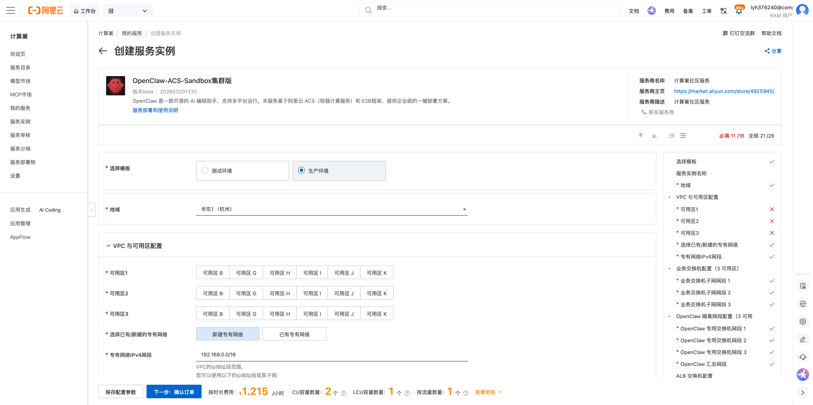
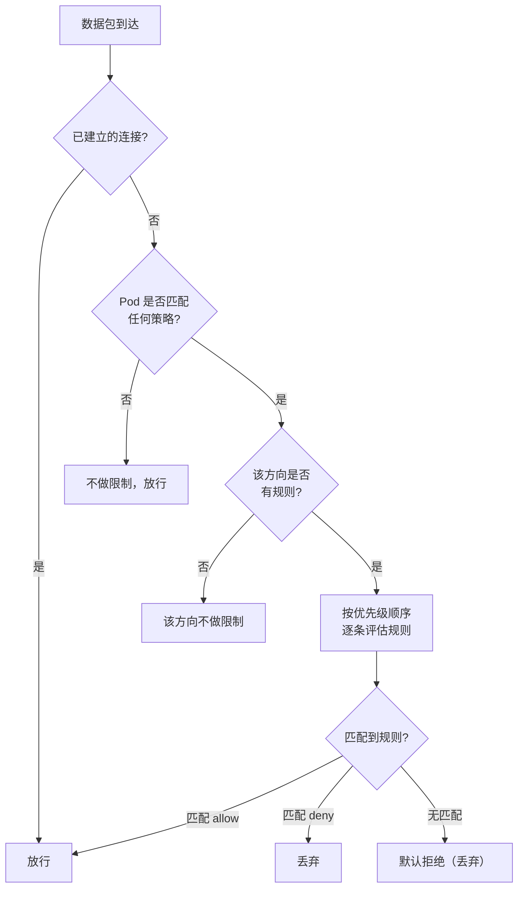

# OpenClaw 企业版 - 生产级部署指南

本文档介绍 OpenClaw 企业版**生产级**部署方案，适用于对网络隔离、安全性、高可用有严格要求的企业客户。


## 方案概览

生产级部署基于 **ACK 托管集群 + VirtualNode (ACS)** 架构，支持 **3 可用区高可用**、**Poseidon TrafficPolicy 网络隔离**和 **PodNetworking VSwitch 隔离**。

- **集群类型**：ACK Pro 托管集群 + VirtualNode（Sandbox Pod 运行在 ACS 弹性算力上）
- **节点管理**：ECS 节点池运行管控组件（sandbox-manager 等），Sandbox Pod 按需弹性
- **网络隔离**：Poseidon TrafficPolicy + PodNetworking + 安全组多层隔离
- **高可用**：3 可用区部署，6 交换机（3 业务 + 3 OpenClaw 隔离）

### 网络架构

- **3 可用区**：跨 AZ 高可用部署
- **6 交换机**：3 个业务交换机 + 3 个 OpenClaw 隔离交换机
- **独立 NAT 网关**：OpenClaw 沙箱使用独立 NAT 网关和 EIP 出公网
- **ALB Ingress**：通过 ALB 负载均衡器作为入口网关
- **PrivateZone**：VPC 内泛域名解析

```
                    ┌─────────────────────────────────────────────────┐
                    │                    VPC                          │
                    │                                                 │
                    │  ┌──────────────┐    ┌──────────────────────┐   │
  用户请求 ──────────┤  │  ALB Ingress │───▶│  sandbox-manager     │   │
                    │  └──────────────┘    │  (sandbox-system ns)  │   │
                    │                      └──────────┬───────────┘   │
                    │                                 │               │
                    │         ┌────────────────────────┘               │
                    │         ▼                                       │
                    │  ┌─────────────────────────────────────────┐    │
                    │  │     OpenClaw 隔离网段 (独立交换机)        │    │
                    │  │                                         │    │
                    │  │  ┌──────────┐ ┌──────────┐ ┌─────────┐ │    │
                    │  │  │ Sandbox1 │ │ Sandbox2 │ │ Sandbox3│ │    │
                    │  │  └────┬─────┘ └────┬─────┘ └────┬────┘ │    │
                    │  │       │            │            │       │    │
                    │  │       └────────────┼────────────┘       │    │
                    │  │                    │                    │    │
                    │  └────────────────────┼────────────────────┘    │
                    │                       │                         │
                    │              ┌────────▼────────┐                │
                    │              │  独立 NAT 网关   │                │
                    │              │  (独立 EIP)      │                │
                    │              └────────┬────────┘                │
                    └───────────────────────┼─────────────────────────┘
                                            │
                                            ▼
                                        公网服务
```

### 网络隔离策略

生产级部署通过多层安全策略实现沙箱网络隔离：

**第一层：VSwitch 隔离（PodNetworking）**
- 通过 PodNetworking CRD 将 OpenClaw 沙箱 Pod 调度到独立的隔离交换机，与业务网络物理隔离

**第二层：Poseidon TrafficPolicy**
- 通过 GlobalTrafficPolicy 和 TrafficPolicy CRD 实现 Kubernetes 层面的精细化网络策略

**第三层：独立 NAT 网关**
- OpenClaw 沙箱使用独立的 NAT 网关和 EIP 出公网，与业务流量完全隔离

**核心安全规则**：
- ✅ 允许：sandbox-manager → Sandbox（管控流量）
- ✅ 允许：Sandbox → 公网（通过独立 NAT）
- ✅ 允许：Sandbox → DNS 服务
- ❌ 拒绝：Sandbox → VPC 内网段（防止横向渗透）
- ❌ 拒绝：Sandbox → 元数据服务（100.100.100.200）
- ❌ 拒绝：其他应用 → OpenClaw 网段（全局隔离）

## 前置条件

1. 拥有阿里云账号，并已完成实名认证
2. 准备 TLS 证书文件（`fullchain.pem` 和 `privkey.pem`），用于 E2B API 的 HTTPS 访问
3. （可选）准备百炼 API Key，用于 OpenClaw 的 AI 能力
4. 给RAM 用户授权：
   如果您使用的是RAM用户，需要授权RAM用户相关权限，才能够完成部署流程，参考[授权文档](https://help.aliyun.com/zh/compute-nest/security-and-compliance/grant-user-permissions-to-a-ram-user)
   部署此服务需要的权限策略包括两个系统权限策略和一个自定义权限策略, 请联系有管理员权限的用户对RAM用户授予以下权限：
   **系统权限策略：**
   - AliyunComputeNestUserFullAccess：管理计算巢服务（ComputeNest）的用户侧权限，
   - AliyunROSFullAccess：管理资源编排服务（ROS）的权限。
   **自定义权限策略：**：[policy_prod.json](https://github.com/aliyun-computenest/openclaw-acs-sandbox/blob/main/docs/policy_prod.json)

## 部署步骤

### 步骤 1：创建服务实例

1. 登录 [计算巢控制台](https://computenest.console.aliyun.com)
2. 找到 **OpenClaw-ACS-Sandbox集群版** 服务
3. 点击 **创建服务实例**



### 步骤 2：选择模板

在创建页面顶部，选择 **生产环境** 模板：

- **测试环境**：单可用区，适合快速验证
- **生产环境**：3 可用区高可用，网络隔离，适合正式使用

### 步骤 3：配置 VPC 与可用区

| 参数 | 说明 | 建议值 |
|------|------|--------|
| **可用区 1/2/3** | 选择 3 个不同的可用区 | 根据地域选择 |
| **选择已有/新建的专有网络** | 新建或使用已有 VPC | 新建专有网络 |
| **专有网络 IPv4 网段** | VPC 主网段 | `192.168.0.0/16` |

### 步骤 4：配置业务交换机

为 3 个可用区分别配置业务交换机网段，用于集群节点和管控组件：

| 参数 | 说明 | 建议值 |
|------|------|--------|
| **业务交换机子网网段 1** | 可用区 1 的业务网段 | `192.168.0.0/24` |
| **业务交换机子网网段 2** | 可用区 2 的业务网段 | `192.168.1.0/24` |
| **业务交换机子网网段 3** | 可用区 3 的业务网段 | `192.168.2.0/24` |

### 步骤 5：配置 OpenClaw 隔离网段

为 OpenClaw 沙箱配置独立的隔离网段，实现与业务网络的物理隔离：

| 参数 | 说明 | 建议值 |
|------|------|--------|
| **OpenClaw 专用交换机网段 1** | 可用区 1 的隔离网段 | `10.8.0.0/24` |
| **OpenClaw 专用交换机网段 2** | 可用区 2 的隔离网段 | `10.8.1.0/24` |
| **OpenClaw 专用交换机网段 3** | 可用区 3 的隔离网段 | `10.8.2.0/24` |

> ⚠️ **重要**：OpenClaw 隔离网段建议使用与 VPC 主网段不同的地址空间（如 `10.8.x.0/24`），便于 TrafficPolicy 和安全组规则精细化控制。模版会自动从交换机网段 1 推算 VPC 附加 CIDR（取前两段拼 `.0.0/16`），无需手动配置。

> 🔒 **3 个 OpenClaw 交换机必须互不相同**
>
> 每个 OpenClaw 交换机承载独立的路由表关联和 SNAT 规则，是网络隔离的基础。如果两个交换机选择了同一个 VSwitch，会导致路由表重复关联和 SNAT 规则冲突，部署将失败。
>
> **即使地域只有 2 个可用区，也必须选择 3 个不同的交换机**。同一个可用区内可以创建多个不同 CIDR 的交换机。例如：
>
> | 参数 | 可用区 | VSwitch | CIDR |
> |------|--------|---------|------|
> | OpenClaw 交换机 1 | cn-beijing-g | vsw-aaa | `10.8.0.0/24` |
> | OpenClaw 交换机 2 | cn-beijing-h | vsw-bbb | `10.8.1.0/24` |
> | OpenClaw 交换机 3 | cn-beijing-h | vsw-ccc | `10.8.2.0/24` |
>
> 上例中，交换机 2 和 3 在同一个可用区（cn-beijing-h），但使用不同的 CIDR，因此是两个不同的 VSwitch，满足隔离要求。
>

### 步骤 6：配置集群参数

| 参数 | 说明 | 建议值 |
|------|------|--------|
| **Service CIDR** | Kubernetes Service 网段 | `172.16.0.0/16` |

> Service CIDR 不能与 VPC 网段和已有集群网段重复，创建后不可修改。

### 步骤 7：配置 Sandbox 参数

| 参数 | 说明 | 是否必填 |
|------|------|---------|
| **Sandbox 访问域名** | Sandbox API 的访问域名 | 选填 |
| **TLS 证书** | `fullchain.pem` 证书文件 | **必填** |
| **TLS 证书密钥** | `privkey.pem` 私钥文件 | **必填** |
| **是否配置内网域名解析** | 自动创建 PrivateZone | 建议开启 |
| **PrivateZone 创建方式** | 新建或复用已有 PrivateZone（仅 ExistingVPC + 开启内网域名解析时显示）。若该 VPC 下已存在同名域名的 PrivateZone，请选择"复用已有" | 默认新建 |
| **Sandbox API 访问密钥** | 访问 Sandbox 管理 API 的密钥 | 选填 |
| **Sandbox Manager CPU** | sandbox-manager CPU 资源 | 默认即可 |
| **Sandbox Manager 内存** | sandbox-manager 内存资源 | 默认即可 |
| **Sandbox Manager 调度到虚拟节点** | 是否将 Sandbox Manager 调度到虚拟节点（ACS 模式），启用后 Sandbox Manager 将运行在 Serverless 虚拟节点上 | 默认开启 |
| **为 ALB 指定独立交换机** | 开启后可为 ALB 单独指定交换机，与集群节点交换机隔离（仅 ExistingVPC 场景生效） | 选填 |
| **ALB 交换机ID（可用区1）** | ALB 在可用区 1 使用的专用交换机，须属于同一 VPC | 选填（开启独立交换机后必填） |
| **ALB 交换机ID（可用区2）** | ALB 在可用区 2 使用的专用交换机，须属于同一 VPC | 选填（开启独立交换机后必填） |

### 步骤 8：配置 OpenClaw 参数

| 参数 | 说明 | 是否必填 |
|------|------|---------|
| **Sandbox 命名空间** | SandboxSet（OpenClaw Pod）和 TestPod 所在的 Kubernetes 命名空间，sandbox-manager 固定部署在 sandbox-system 不受此参数影响 | 默认 `default` |

### 步骤 9：确认并创建

1. 点击 **下一步：确认订单**
2. 确认配置参数和费用
3. 点击 **创建** 开始部署

> 部署预计耗时 **15-22 分钟**，请耐心等待。

## 部署验证

### 查看服务实例状态

部署完成后，在计算巢控制台的 **服务实例** 页面可以看到实例状态变为 **已部署**。

##  自动化测试 (无需配置本地环境和域名解析，可用于快速验证)
1. 点击计算巢服务实例，找到实例内包含的acs的集群。
2. 点击集群容器组界面，找到acs-test-pod，点击终端登录
3. 测试创建OpenClaw 沙箱
   
 - 配置以下环境变量，为OpenClaw配置GATEWAY_TOKEN 以及访问百炼的API_KEY,若不执行此步骤，将会使用默认值
      GATEWAY_TOKEN的默认值为：clawdbot-mode-123456
      DASHSCOPE_API_KEY的默认值为：sk-****
   ```bash
     export GATEWAY_TOKEN=****
     export DASHSCOPE_API_KEY=****    
   ```
 - 执行 `python create_openclaw.py`
 - 等待脚本完成，得到SandboxId，服务就绪后说明OpenClaw 启动成功，可以访问对应沙箱的OpenClaw Web UI
4. 测试创建、休眠、唤醒Openclaw 沙箱
    - 执行 `python test_openclaw.py`
5. 等待脚本验证所有功能通过，日志中出现 **"创建 sandbox 耗时"** 即代表验证通过

## SandboxSet 配置

生产级 SandboxSet 配置示例：

```yaml
apiVersion: agents.kruise.io/v1alpha1
kind: SandboxSet
metadata:
  name: openclaw
  namespace: default
  labels:
    app: openclaw
spec:
  persistentContents:
    - filesystem
  replicas: 1
  template:
    metadata:
      labels:
        alibabacloud.com/acs: "true"
        app: openclaw
      annotations:
        ops.alibabacloud.com/pause-enabled: "true"
        k8s.aliyun.com/eci-network-policy-enable: "true"
        network.alibabacloud.com/enable-network-policy-agent: "true"
        network.alibabacloud.com/network-policy-mode: "traffic-policy"
    spec:
      automountServiceAccountToken: false
      enableServiceLinks: false
      hostNetwork: false
      hostPID: false
      hostIPC: false
      shareProcessNamespace: false
      hostname: openclaw
      dnsPolicy: None
      dnsConfig:
        nameservers:
          - "100.100.2.136"
          - "100.100.2.138"
        searches:
          - default.svc.cluster.local
          - svc.cluster.local
          - cluster.local
        options:
          - name: ndots
            value: "5"
      initContainers:
        - name: tini-copy
          image: kube-ai-registry.cn-shanghai.cr.aliyuncs.com/kube-ai/ubuntu-tini:krallin-ubuntu-tini-latest
          command: ["sh", "-c"]
          args:
            - |
              cp /usr/bin/tini /mnt/tini/tini
              chmod +x /mnt/tini/tini
          volumeMounts:
            - name: tini-volume
              mountPath: /mnt/tini
        - name: init
          image: registry-cn-hangzhou.ack.aliyuncs.com/acs/agent-runtime:v0.0.2
          command: [ "sh", "/workspace/entrypoint_inner.sh" ]
          volumeMounts:
            - name: envd-volume
              mountPath: /mnt/envd
          env:
            - name: ENVD_DIR
              value: /mnt/envd
            - name: __IGNORE_RESOURCE__
              value: "true"
          restartPolicy: Always
      containers:
        - name: gateway
          image: "registry-cn-hangzhou.ack.aliyuncs.com/ack-demo/openclaw:2026.3.23-2"
          securityContext:
            readOnlyRootFilesystem: false
            runAsUser: 0
            runAsGroup: 0
          command: ["/mnt/tini/tini", "--"]
          args:
            - bash
            - -c
            - "echo ${CmsGatewayStartScriptB64} | base64 -d | bash"
          ports:
            - name: gateway
              containerPort: 18789
              protocol: TCP
            - name: runtime
              containerPort: 49983
              protocol: TCP
          env:
            - name: ENVD_DIR
              value: /mnt/envd
            - name: OPENCLAW_CONFIG_DIR
              value: /root/.openclaw
            - name: KUBERNETES_SERVICE_PORT_HTTPS
              value: ""
            - name: KUBERNETES_SERVICE_PORT
              value: ""
            - name: KUBERNETES_PORT_443_TCP
              value: ""
            - name: KUBERNETES_PORT_443_TCP_PROTO
              value: ""
            - name: KUBERNETES_PORT_443_TCP_ADDR
              value: ""
            - name: KUBERNETES_SERVICE_HOST
              value: ""
            - name: KUBERNETES_PORT
              value: ""
            - name: KUBERNETES_PORT_443_TCP_PORT
              value: ""
          volumeMounts:
            - name: envd-volume
              mountPath: /mnt/envd
            - name: tini-volume
              mountPath: /mnt/tini
          resources:
            requests:
              cpu: 2
              memory: 4Gi
            limits:
              cpu: 2
              memory: 4Gi
          lifecycle:
            postStart:
              exec:
                command:
                  - bash
                  - /mnt/envd/envd-run.sh
          startupProbe:
            exec:
              command:
                - node
                - -e
                - "require('http').get('http://127.0.0.1:18789/healthz', r => process.exit(r.statusCode < 400 ? 0 : 1)).on('error', () => process.exit(1))"
            initialDelaySeconds: 5
            periodSeconds: 5
            failureThreshold: 60
          # livenessProbe:
          #   exec:
          #     command:
          #       - node
          #       - -e
          #       - "require('http').get('http://127.0.0.1:18789/healthz', r => process.exit(r.statusCode < 400 ? 0 : 1)).on('error', () => process.exit(1))"
          #   initialDelaySeconds: 60
          #   periodSeconds: 30
          #   timeoutSeconds: 10
          # readinessProbe:
          #   exec:
          #     command:
          #       - node
          #       - -e
          #       - "require('http').get('http://127.0.0.1:18789/readyz', r => process.exit(r.statusCode < 400 ? 0 : 1)).on('error', () => process.exit(1))"
          #   initialDelaySeconds: 15
          #   periodSeconds: 10
          #   timeoutSeconds: 5
      terminationGracePeriodSeconds: 1
      volumes:
        - name: envd-volume
          emptyDir: { }
        - name: tini-volume
          emptyDir: { }
```

**重要字段说明**

*   `SandboxSet.spec.persistentContents: filesystem` — 在 pause/connect 的过程中只保留文件系统（不保留 IP、内存）
*   `template.spec.automountServiceAccountToken: false` — Pod 不挂载 Service Account
*   `template.spec.enableServiceLinks: false` — Pod 不注入 Service 环境变量
*   `template.metadata.labels.alibabacloud.com/acs: "true"` — 使用 ACS 算力
*   `template.metadata.annotations.ops.alibabacloud.com/pause-enabled: "true"` — 支持 pause/connect 动作
*   `template.metadata.annotations.k8s.aliyun.com/eci-network-policy-enable: "true"` — 启用 ECI 网络策略
*   `template.metadata.annotations.network.alibabacloud.com/enable-network-policy-agent: "true"` — 启用网络策略 Agent
*   `template.metadata.annotations.network.alibabacloud.com/network-policy-mode: "traffic-policy"` — 使用 Poseidon TrafficPolicy 模式实现网络隔离
*   `template.spec.dnsPolicy: None` + `dnsConfig` — 自定义 DNS 配置，使用阿里云内网 DNS 服务器
*   `template.spec.nodeSelector.type: virtual-kubelet` — 调度到 VirtualNode（ACS 弹性算力）
*   `template.spec.tolerations` — 容忍 VirtualNode 的 NoSchedule 污点
*   `template.spec.initContainer` — 下载并 copy envd 的环境，保留即可
*   `template.spec.initContainers.restartPolicy: Always`
*   `template.spec.containers.securityContext.runAsNonRoot: true` — Pod 使用普通用户启动
*   `template.spec.containers.securityContext.privileged: false` — 禁用特权配置
*   `template.spec.containers.securityContext.allowPrivilegeEscalation: false`
*   `template.spec.containers.securityContext.seccompProfile.type: RuntimeDefault`
*   `template.spec.containers.securityContext.capabilities.drop: [ALL]`
*   `template.spec.containers.securityContext.readOnlyRootFilesystem: false`

> ⚠️ 如果预期使用 Pause，**一定不要设置** liveness/readiness 的探针，避免在暂停期间的健康检查问题。

**必要的修改**

*   `registry-cn-hangzhou.ack.aliyuncs.com/acs/agent-runtime` — 修改为所在地域的镜像，并且是内网镜像（目前需手动替换，未来会自动注入）
*   `registry-cn-hangzhou.ack.aliyuncs.com/ack-demo/openclaw:2026.3.23-2` — 替换为客户自己构建的镜像
*   若为了提升拉取速度，也可替换为内网镜像：`registry-${RegionId}-vpc.ack.aliyuncs.com/ack-demo/openclaw:2026.3.23-2`

**机制简要说明**

通过在 Pod 启动 envd，来支持 E2B SDK 的服务端接口。通过 kubectl 创建上述资源，SandboxSet 创建完成后，可以看到沙箱已经处于可用状态。

## 访问 OpenClaw Web UI

### 域名格式

OpenClaw 沙箱通过 PrivateZone 泛域名解析 + ALB 路由实现访问，域名格式为：

```
<port>-<namespace>--<pod-name>.<e2b-domain>?token=<gateway-token>
                 ↑↑
              双连字符（重要！）
```

**参数说明**：
- **`port`**：OpenClaw Web UI 端口，固定为 `18789`
- **`namespace`**：Pod 所在命名空间，默认为 `default`
- **`pod-name`**：Sandbox Pod 名称，如 `openclaw-abc12`
- **`e2b-domain`**：部署时配置的 E2B 域名
- **`gateway-token`**：SandboxSet 中配置的 `GATEWAY_TOKEN` 值

**示例 URL**：
```
https://18789-default--openclaw-abc12.agent-vpc.infra?token=clawdbot-mode-123456
```

> ⚠️ namespace 和 pod-name 之间必须使用**双连字符 `--`**，使用单连字符会导致 502 错误。

### 获取 Sandbox Pod 名称

```bash
kubectl get pods -n default -l app=openclaw
```

### 配置域名解析


#### 方式一：DNS 解析（生产环境）

1. 获取 ALB 访问端点
2. 在 DNS 服务商处，将 ALB 端点以 **CNAME** 记录解析到对应域名
3. 如需内网访问，可通过 PrivateZone 添加内网域名解析

#### 方式二：本地 Host 配置（需开启ALB公网访问，仅用于临时快速验证）

1. 获取 ALB 访问端点：在服务实例详情页查看 ALB 域名
2. 通过 `ping` 或 `dig` 获取 ALB 公网 IP
3. 配置 `/etc/hosts`：

```bash
sudo vim /etc/hosts
# 添加以下内容（替换为实际的 ALB IP 和 Pod 名称）
39.103.89.43 18789-default--openclaw-abc12.agent-vpc.infra
39.103.89.43 api.agent-vpc.infra
```
## 使用沙箱Demo

### 通过 Python SDK 创建

1. 安装 E2B Python SDK

```bash
pip install e2b-code-interpreter
```

2. 初始化客户端运行环境配置

```bash
export E2B_DOMAIN=your.domain
export E2B_API_KEY=your-token
# 如果使用了自签名证书，还需要配置可信CA证书
export SSL_CERT_FILE=/path/to/ca-fullchain.pem
```

#### 创建沙箱并配置用户信息

为用户配置的OpenClaw的GATEWAY_TOKEN 以及访问百炼的API_KEY,
   ```bash
     export GATEWAY_TOKEN=****
     export DASHSCOPE_API_KEY=****    
   ```
为用户申请 Sandbox，并在 Sandbox 中配置个人信息。以下代码会读取 [openclaw_template.json]() 配置模板，注入用户独立的 token 和 LLM 鉴权信息。

```python
   # Import and patch the E2B SDK
    import os
    import requests
    from string import Template
    from e2b_code_interpreter import Sandbox
    
    # 注意为用户配置 never timeout
    sbx: Sandbox = Sandbox.create(template="openclaw-sbs", metadata={
                                   "e2b.agents.kruise.io/never-timeout": "true"
                                 })
    print(f"sandbox id: {sbx.sandbox_id}")
    
    # 基于环境变量中的 GATEWAY_TOKEN, DASHSCOPE_API_KEY, EXTERNAL_ACCESS_DOMAIN 读取
    GATEWAY_TOKEN = os.environ.get("GATEWAY_TOKEN", "clawdbot-mode-123456")
    DASHSCOPE_API_KEY = os.environ.get("DASHSCOPE_API_KEY", "sk-****")
    
    
    #渲染 openclaw-template.json 文件， 并将渲染后的文件覆盖沙盒中 /root/.openclaw/openclaw.json 的内容，触发openclaw重启更新配置
    template_path = "openclaw_template.json"
    with open(template_path, "r") as f:
        template_content = f.read()
    
    rendered_content = Template(template_content).safe_substitute(
        GATEWAY_TOKEN=GATEWAY_TOKEN,
        DASHSCOPE_API_KEY=DASHSCOPE_API_KEY,
    )
    
    sbx.files.write("/root/.openclaw/openclaw.json", rendered_content)
    print("已将渲染后的配置写入沙盒 /root/.openclaw/openclaw.json")
    print(f"sandbox: {sbx}")
    print(f"sandbox id: {sbx.sandbox_id}")
```

执行代码可以得到创建后返回的Sandbox对象，获取新创建Sandbox对象的详细信息

```python
print(f"sandbox: {sbx}")
print(f"sandbox id: {sbx.sandbox_id}")
> 创建后返回的 Sandbox 对象中包含新创建 Sandbox 的详细信息。sandbox id 的命名格式为 `{Namespace}--{Sandbox Name}`，其中 `--` 之前为对应资源所处的 K8s 命名空间，之后为 Sandbox 的名称。

#### 休眠与唤醒

当用户长时间不使用时，可以将对应 Sandbox 挂起，触发沙箱休眠。休眠期间，沙箱中文件系统等状态被冻结，ACS 不会收取 CPU、Memory 资源的费用，只会产生少量的存储成本。

```python
from e2b_code_interpreter import Sandbox

# 通过 sandbox ID 连接到已存在的 sandbox
sandbox_id = "default--openclaw-52xbx"  # 替换为你的实际 sandbox ID
# 注意根据申请时的申请信息，配置timeout时间
sbx = Sandbox.connect(sandbox_id, timeout=2592000)

# 挂起Sandbox
sbx.beta_pause()

input("press ENTER to step")

# 恢复被挂起的Sandbox，注意timeout配置
sbx.connect(timeout=2592000)
```

> 沙箱休眠成功后，沙箱的状态会变成休眠状态，对应的 Pod 也会消失。注意沙箱实例休眠期间，OpenClaw 服务将处于不可访问状态。

## 网络隔离详解

生产级部署通过 **Poseidon 网络策略组件**和 **PodNetworking CRD** 实现 Kubernetes 层面的网络隔离。


#### 网段角色定义

从 OpenClaw Sandbox Pod 的视角出发，网络中的各个网段按照**数据流方向**分为以下角色：

| 概念名称 | 含义 | 模板参数/资源 | 默认值示例 | 运行时实体 |
|---------|------|-------------|-----------|-----------|
| **vsw-downstream** | **下游网段**。指"谁可以访问 Sandbox Pod"——即 sandbox-manager、ALB 等管控组件所在的业务交换机。流量方向：downstream → openclaw | 参数 `VSwitchCidrBlock1/2/3`，资源 `BusinessVSwitch1/2/3` | `192.168.0.0/24`、`192.168.1.0/24`、`192.168.2.0/24` | sandbox-manager Pod（如 `192.168.1.133`）、ALB、ECS 节点 |
| **vsw-openclaw** | **OpenClaw 隔离网段**。Sandbox Pod 实际运行的独立交换机，与业务网络物理隔离。生产环境下为 3 个（每个可用区一个） | 参数 `OpenClawVSwitchCidrBlock1/2/3` + `OpenClawCidrBlock`（汇总），资源 `OpenClawVSwitch1/2/3` | `10.8.0.0/24`、`10.8.1.0/24`、`10.8.2.0/24`，汇总 `10.8.0.0/16` | Sandbox Pod（如 `10.8.104.114`） |
| **vsw-upstream** | **上游网段**。指"Sandbox Pod 可以访问谁"——即公网出口方向。在当前架构中，upstream 不是独立交换机，而是通过独立 NAT 网关出公网，NAT 网关本身位于 downstream 网段中 | 资源 `OpenClawNatGateway` + `OpenClawNatEip` | NAT EIP 如 `39.102.72.45` | 独立 NAT 网关 → 公网 |
| **vsw-apiserver** | **API Server 网段**。Sandbox Pod 需要与 K8s API Server 和 Poseidon 管控面通信。在当前架构中，API Server 运行在 VPC 主网段内的某个 IP 上，不是独立交换机 | 参数 `VpcCidrBlock`（API Server IP 在此范围内） | API Server IP 如 `192.168.0.x` | API Server（端口 6443）、Poseidon（端口 9082） |

> **简单理解**：downstream 是"谁来找我"，upstream 是"我去找谁"，openclaw 是"我在哪"，apiserver 是"我的管控面在哪"。

#### 网段与流量方向图

```
                  downstream (业务网段)                    openclaw (隔离网段)
              ┌──────────────────────┐              ┌──────────────────────┐
              │  192.168.0.0/24 (AZ1)│              │  10.8.0.0/24 (AZ1)  │
              │  192.168.1.0/24 (AZ2)│──ingress──▶  │  10.8.1.0/24 (AZ2)  │
              │  192.168.2.0/24 (AZ3)│              │  10.8.2.0/24 (AZ3)  │
              │                      │              │                      │
              │  sandbox-manager     │              │  Sandbox Pod         │
              │  ALB / ECS 节点      │              │  (app: openclaw)     │
              └──────────────────────┘              └──────────┬───────────┘
                                                               │ egress
                                                               ▼
                                                    ┌──────────────────────┐
                                                    │  独立 NAT 网关        │
                                                    │  (upstream → 公网)    │
                                                    │  EIP: 39.x.x.x      │
                                                    └──────────────────────┘
                                                               │
                                                               ▼
                                                           公网服务
```

#### 两层安全组

模板中创建了**两个安全组**，分别承担不同的安全职责：

| 安全组 | 模板资源名 | 类型 | 关联对象 | 核心作用 |
|--------|----------|------|---------|---------|
| **集群安全组** | `OpenClawSecurityGroup` | normal（默认同组互通） | ACK 集群整体（ECS 节点、VirtualNode） | 保证集群基础组件正常运行。额外放行 OpenClaw 网段访问 API Server 6443 和 Poseidon 9082 |
| **隔离安全组** | `OpenClawIsolationSecurityGroup` | enterprise（默认同组不互通） | 仅 OpenClaw Sandbox Pod（通过 PodNetworking 关联） | **Pod 间网络隔离的底层保障**。enterprise 类型的 `InnerAccessPolicy=Drop` 确保同安全组内的 Sandbox Pod 之间默认不互通 |

**隔离安全组的关键规则**（对应"企业安全组规则"）：

- **入方向**：允许 VPC 主网段（downstream）全端口访问 → 对应模板参数 `VpcCidrBlock`
- **出方向**：
  - 允许访问 API Server 6443 → 对应 `VpcCidrBlock` 和 `ServiceCidr`
  - 允许访问 Poseidon 9082 → 对应 `VpcCidrBlock`
  - 允许 DNS 53 → 对应 `ServiceCidr` 和 `VpcCidrBlock`
  - 允许云产品网段 `100.64.0.0/10`（镜像仓库、SLB 等）
  - 允许公网 `0.0.0.0/0`（优先级最低，通过 NAT 出去）
  - **未显式放行的流量自动拒绝**（enterprise 安全组默认 Drop）

#### 三层隔离机制与模板资源对应

| 隔离层 | 机制 | 模板资源 | 说明 |
|--------|------|---------|------|
| **第一层：VSwitch 隔离** | PodNetworking CRD | `OpenClawPodNetworking` | 将 Sandbox Pod 调度到 OpenClaw 独立交换机（`OpenClawVSwitch1/2/3`），绑定隔离安全组（`OpenClawIsolationSecurityGroup`） |
| **第二层：Poseidon TrafficPolicy** | GlobalTrafficPolicy + TrafficPolicy | `GlobalTrafficPolicyApplication` + `OpenClawTrafficPolicyApplication` | K8s 层面的精细化网络策略，控制 ingress/egress 流量 |
| **第三层：独立 NAT 网关** | 独立路由表 + NAT + EIP | `OpenClawRouteTable` + `OpenClawNatGateway` + `OpenClawNatEip` | OpenClaw 交换机使用独立路由表，默认路由指向独立 NAT，出公网流量与业务完全隔离 |

### GlobalTrafficPolicy

全局级策略，保护集群中**其他应用**不被 OpenClaw 网段访问（防止横向渗透）。

- **模板资源**：`GlobalTrafficPolicyApplication`
- **作用对象**：`selector: {}`（所有 Pod）
- **核心逻辑**：拒绝来自 OpenClaw 网段（`OpenClawCidrBlock`）的入站流量，允许其他所有来源

```yaml
apiVersion: network.alibabacloud.com/v1alpha1
kind: GlobalTrafficPolicy
metadata:
  name: global-black-list
spec:
  priority: 1000
  selector: {}
  ingress:
    rules:
      - action: deny
        from:
          - cidr: <OpenClawCidrBlock>  # 如 10.8.0.0/16，拒绝来自 OpenClaw 网段的入站
      - action: allow
        from:
          - cidr: 0.0.0.0/0           # 允许其他所有来源
  egress:
    rules:
      - action: allow
        to:
          - cidr: 0.0.0.0/0           # 不限制出方向
```

> **规则匹配逻辑**：从上到下逐条匹配，命中第一条规则即停止。因此 deny openclaw 在前，allow 0.0.0.0/0 在后，确保 OpenClaw 网段被拒绝而其他来源被放行。

## TrafficPolicy

> 以下内容来自 Poseidon TrafficPolicy 官方文档，详细介绍了 TrafficPolicy 的核心概念、API 参考和使用示例。

#### 概述

TrafficPolicy 是一种 Kubernetes 自定义资源（CRD），用于以声明式方式控制 Pod 的出站（Egress）和入站（Ingress）网络流量。相较于 Kubernetes 原生的 NetworkPolicy，TrafficPolicy 提供了更灵活的流量控制能力，支持 CIDR、Service 引用和 FQDN 域名三种目标类型，以及细粒度的优先级控制。

| 属性 | 值 |
|------|-----|
| API Group | `network.alibabacloud.com` |
| API Version | `v1alpha1` |
| 资源类型 | `TrafficPolicy`（命名空间级）、`GlobalTrafficPolicy`（集群级） |
| 简称 | `tp`（TrafficPolicy）、`gtp`（GlobalTrafficPolicy） |

#### 核心概念

##### TrafficPolicy 与 GlobalTrafficPolicy

系统提供两种资源类型来满足不同的管理粒度：

| 特性 | TrafficPolicy | GlobalTrafficPolicy |
|------|---------------|---------------------|
| 作用范围 | 命名空间级（Namespaced） | 集群级（Cluster） |
| Pod 选择范围 | 仅选择同一命名空间内的 Pod | 选择集群中所有命名空间的 Pod |
| 简称 | `tp` | `gtp` |
| 典型场景 | 应用级流量控制 | 全集群安全基线策略 |

两者共享相同的 Spec 结构和优先级体系，区别仅在于作用范围。

##### Peer 类型

每条规则中的 `to`（出站目标）或 `from`（入站来源）通过 Peer 对象来描述。支持三种类型：

**CIDR**：直接指定 IP 地址段，使用标准 CIDR 表示法。

```yaml
to:
  - cidr: 10.0.0.0/8        # 整个 10.x.x.x 网段
  - cidr: 8.8.8.8/32         # 单个 IP 地址
```

**Service**：引用 Kubernetes Service，系统会自动解析该 Service 的 ClusterIP 和 EndpointSlice 中所有 Pod 的 IP 地址。Service 名称支持通配符 `*`，表示匹配该命名空间下的所有 Service。

```yaml
to:
  - service:
      name: my-service            # Service 名称（必填）
      namespace: other-namespace  # 命名空间（可选，默认为策略所在命名空间）
```

**FQDN**：指定完全限定域名，系统通过 DNS A 记录查询将域名解析为 IP 地址，并自动维护 TTL 缓存（最小 10 秒，最大 5 分钟）。

```yaml
to:
  - fqdn: "api.example.com"
```

##### 优先级机制

通过 `spec.priority` 字段控制策略的评估顺序：

- **数值越小，优先级越高**（priority=0 为最高优先级），默认值为 **1000**
- TrafficPolicy 和 GlobalTrafficPolicy 使用同一套优先级体系

| 优先级数值 | 含义 |
|-----------|------|
| 0 - 99 | 高优先级，通常用于安全策略 |
| 100 - 999 | 中等优先级，通常用于应用策略 |
| 1000（默认） | 默认优先级 |
| 1001+ | 低优先级，通常用于兜底策略 |

##### 默认拒绝行为

TrafficPolicy 采用白名单模型：

- 当 Pod 被**至少一个**策略选中，且该方向（egress 或 ingress）存在规则时，**未命中任何规则的流量将被丢弃**（default deny）
- 已建立的连接（TCP established 和 related 状态）始终放行，不受策略影响
- 如果某个方向（egress/ingress）没有任何规则，则该方向的流量不受限制

#### API 参考

```yaml
apiVersion: network.alibabacloud.com/v1alpha1
kind: TrafficPolicy
metadata:
  name: <策略名称>
  namespace: <命名空间>
spec:
  priority: <优先级>
  selector: <Pod 选择器>
  egress: <出站规则>
  ingress: <入站规则>
```

```yaml
apiVersion: network.alibabacloud.com/v1alpha1
kind: GlobalTrafficPolicy
metadata:
  name: <策略名称>
spec:
  priority: <优先级>
  selector: <Pod 选择器>
  egress: <出站规则>
  ingress: <入站规则>
```

**Spec 字段说明**：

| 字段 | 类型 | 必填 | 默认值 | 说明 |
|------|------|------|--------|------|
| `spec.priority` | int32 | 否 | 1000 | 策略优先级，数值越小优先级越高，最小值为 0 |
| `spec.selector` | LabelSelector | **是** | - | Pod 选择器，使用标准 Kubernetes 标签选择器语法 |
| `spec.egress.rules` | []Rule | 否 | - | 出站规则列表 |
| `spec.ingress.rules` | []Rule | 否 | - | 入站规则列表 |

**Rule 字段说明**：

| 字段 | 类型 | 必填 | 说明 |
|------|------|------|------|
| `action` | string | **是** | 规则动作：`allow`（放行）或 `deny`（拒绝） |
| `to` | []Peer | 否 | 出站目标列表（用于 egress 规则） |
| `from` | []Peer | 否 | 入站来源列表（用于 ingress 规则） |

**Peer 字段说明**（每个 Peer 只能指定以下三个字段中的一个）：

| 字段 | 类型 | 说明 |
|------|------|------|
| `cidr` | string | CIDR 格式的 IP 地址段，如 `10.0.0.0/8`、`192.168.1.1/32` |
| `fqdn` | string | 完全限定域名，如 `api.example.com` |
| `service.name` | string | Service 名称（必填），支持 `*` 匹配所有 |
| `service.namespace` | string | Service 所在命名空间（可选，默认为策略所在命名空间） |

#### 规则评估顺序

当一个数据包需要做策略匹配时，评估流程如下：



**详细评估逻辑**：

1. **已建立连接放行**：TCP 已建立（established）和关联（related）状态的连接始终放行
2. **策略排序**：所有选中该 Pod 的策略（包括 TrafficPolicy 和 GlobalTrafficPolicy）按 `priority` 数值**从小到大**排列
3. **规则评估**：对每个策略，按 `rules` 数组的索引顺序依次检查。先评估高优先级策略的全部规则，再评估低优先级策略的规则
4. **匹配执行**：数据包的目标/来源 IP 如果落在某条规则的 Peer 解析出的 CIDR 集合中，则执行该规则的 `action`（allow 或 deny）
5. **默认拒绝**：如果所有规则都未匹配，流量被丢弃

#### 使用示例

##### 示例 1：基础 CIDR 出站控制

拒绝 `100.0.0.0/8` 网段的出站流量，但放行 `100.100.100.200` 这个特定 IP：

> 由于 `deny 100.0.0.0/8` 排在前面，发往该网段的流量会先匹配到 deny 规则被丢弃。但 `100.100.100.200/32` 的 allow 规则也会生成独立的规则条目，两条规则在 nftables 中并行匹配——目标 IP 为 `100.100.100.200` 时会同时匹配两条规则，按规则顺序先匹配到 deny。如果需要放行该 IP，应将 allow 规则放在更高优先级的策略中，或调整规则顺序将 allow 放在 deny 之前。

**修正后的写法**（先 allow 再 deny）：

```yaml
apiVersion: network.alibabacloud.com/v1alpha1
kind: TrafficPolicy
metadata:
  name: allow-specific-deny-range
  namespace: my-app
spec:
  priority: 100
  selector:
    matchLabels:
      app: my-client
  egress:
    rules:
      - action: allow
        to:
          - cidr: 100.100.100.200/32
      - action: deny
        to:
          - cidr: 100.0.0.0/8
      - action: allow
        to:
          - cidr: 0.0.0.0/0
```

> 此策略先放行 `100.100.100.200`，再拒绝整个 `100.0.0.0/8` 网段，最后放行其余所有流量。注意最后的 `0.0.0.0/0` allow 规则用于避免默认拒绝行为影响其他正常出站流量。

##### 示例 2：引用 Service

放行到指定 Kubernetes Service 的流量：

```yaml
apiVersion: network.alibabacloud.com/v1alpha1
kind: TrafficPolicy
metadata:
  name: allow-to-kubernetes-api
  namespace: my-app
spec:
  priority: 50
  selector:
    matchLabels:
      app: my-client
  egress:
    rules:
      - action: allow
        to:
          - service:
              name: kubernetes
              namespace: default
      - action: allow
        to:
          - cidr: 0.0.0.0/0
```

系统会自动解析 `default/kubernetes` Service 的 ClusterIP 和所有 EndpointSlice 地址。当 Service 的后端 Pod 发生变化时，规则会自动更新。

**放行到命名空间下所有 Service**：

```yaml
egress:
  rules:
    - action: allow
      to:
        - service:
            name: "*"
            namespace: kube-system
```

##### 示例 3：FQDN 域名控制

放行到特定域名的出站流量：

```yaml
apiVersion: network.alibabacloud.com/v1alpha1
kind: TrafficPolicy
metadata:
  name: allow-external-api
  namespace: my-app
spec:
  priority: 100
  selector:
    matchLabels:
      app: my-client
  egress:
    rules:
      - action: allow
        to:
          - fqdn: "api.example.com"
      - action: allow
        to:
          - service:
              name: kubernetes
              namespace: default
      - action: deny
        to:
          - cidr: 0.0.0.0/0
```

系统会通过 DNS A 记录查询 `api.example.com` 的 IP 地址，并根据 TTL 自动刷新。DNS 查询失败时，会使用上一次的缓存结果。

##### 示例 4：入站控制

控制入站流量来源：

```yaml
apiVersion: network.alibabacloud.com/v1alpha1
kind: TrafficPolicy
metadata:
  name: ingress-control
  namespace: my-app
spec:
  priority: 100
  selector:
    matchLabels:
      app: my-server
  ingress:
    rules:
      - action: allow
        from:
          - cidr: 10.0.0.0/8
      - action: deny
        from:
          - cidr: 192.168.0.0/16
```

此策略允许来自 `10.0.0.0/8` 的入站流量，拒绝来自 `192.168.0.0/16` 的入站流量。不在这两个范围内的其他入站流量将被默认拒绝。

**同时控制出站和入站**：

```yaml
apiVersion: network.alibabacloud.com/v1alpha1
kind: TrafficPolicy
metadata:
  name: bidirectional-control
  namespace: my-app
spec:
  priority: 100
  selector:
    matchLabels:
      app: my-server
  egress:
    rules:
      - action: allow
        to:
          - cidr: 0.0.0.0/0
  ingress:
    rules:
      - action: allow
        from:
          - cidr: 10.0.0.0/8
```

##### 示例 5：GlobalTrafficPolicy 集群级策略

GlobalTrafficPolicy 用于定义全集群范围的流量基线策略：

```yaml
apiVersion: network.alibabacloud.com/v1alpha1
kind: GlobalTrafficPolicy
metadata:
  name: block-external-dns
spec:
  priority: 200
  selector:
    matchLabels:
      security-level: restricted
  egress:
    rules:
      - action: deny
        to:
          - cidr: 8.8.8.8/32
      - action: deny
        to:
          - cidr: 8.8.4.4/32
      - action: allow
        to:
          - cidr: 0.0.0.0/0
```

此全局策略阻止所有带 `security-level: restricted` 标签的 Pod 访问 Google Public DNS（8.8.8.8 和 8.8.4.4），同时允许其他出站流量。

##### 示例 6：多策略协同

多个策略可以共同作用于同一组 Pod，按优先级数值从小到大依次评估：

```yaml
# 策略 1: 高优先级（priority=50）- 放行关键服务
apiVersion: network.alibabacloud.com/v1alpha1
kind: TrafficPolicy
metadata:
  name: allow-critical-services
  namespace: my-app
spec:
  priority: 50
  selector:
    matchLabels:
      app: my-client
  egress:
    rules:
      - action: allow
        to:
          - service:
              name: kubernetes
              namespace: default
      - action: allow
        to:
          - fqdn: "api.example.com"
---
# 策略 2: 中优先级（priority=100）- 拒绝特定网段
apiVersion: network.alibabacloud.com/v1alpha1
kind: TrafficPolicy
metadata:
  name: deny-internal-range
  namespace: my-app
spec:
  priority: 100
  selector:
    matchLabels:
      app: my-client
  egress:
    rules:
      - action: deny
        to:
          - cidr: 100.0.0.0/8
---
# 策略 3: 低优先级（priority=200）- 兜底放行
apiVersion: network.alibabacloud.com/v1alpha1
kind: GlobalTrafficPolicy
metadata:
  name: default-allow-all
spec:
  priority: 200
  selector:
    matchLabels:
      app: my-client
  egress:
    rules:
      - action: allow
        to:
          - cidr: 0.0.0.0/0
```

评估顺序：
1. **priority=50**（策略 1）：先检查是否是到 `kubernetes` Service 或 `api.example.com` 的流量，如果是则放行
2. **priority=100**（策略 2）：再检查是否发往 `100.0.0.0/8`，如果是则拒绝
3. **priority=200**（策略 3）：最后兜底放行所有其他流量

#### 注意事项与限制

1. **FQDN 通配符不支持**：`*.example.com` 等通配符模式的 FQDN 暂不支持，系统会跳过这类规则并记录警告日志
2. **仅支持 IPv4**：当前 CIDR 解析和 nftables 规则仅处理 IPv4 地址，IPv6 地址会被忽略
3. **Service 命名空间默认值**：`service.namespace` 未指定时，默认使用策略所在的命名空间。对于 GlobalTrafficPolicy，建议始终显式指定 `namespace`
4. **默认拒绝**：只要 Pod 匹配到策略且某方向存在规则，该方向未匹配的流量都会被丢弃。务必为需要的流量添加 allow 规则（如添加 `0.0.0.0/0` 的兜底放行规则）
5. **规则顺序很重要**：同一策略内的规则按数组索引顺序评估，请将更具体的规则放在前面
6. **Peer 互斥**：每个 Peer 对象只能指定 `cidr`、`fqdn`、`service` 中的一个。如果需要同时匹配多种类型，请在 `to` 或 `from` 数组中添加多个 Peer
7. **DNS TTL 管理**：FQDN 类型的 Peer 依赖 DNS 解析，解析结果的 TTL 被限制在 10 秒到 5 分钟之间。DNS 服务不可用时会使用缓存中的旧数据（stale-on-failure）
8. **策略更新**：修改策略后，系统会自动重新解析所有规则并更新数据面，通常在秒级完成

#### 状态查看与调试

##### 查看策略列表

```bash
# 查看命名空间级策略
kubectl get tp -n <namespace>

# 查看全局策略
kubectl get gtp

# 查看所有命名空间的策略
kubectl get tp -A
```

##### 查看策略详情

```bash
kubectl describe tp <name> -n <namespace>
```

输出中的关键信息：

- **Spec** 部分：确认 selector、priority 和规则定义是否正确
- **Status.IPSetBindings**：展示每条规则关联的 SelectorIPSet，包括方向（direction）、动作（action）和规则索引（ruleIndex）
- **Status.Conditions**：策略的健康状况

##### 查看 SelectorIPSet

SelectorIPSet 是系统内部创建的资源，保存了规则中 Peer 解析后的实际 CIDR 列表：

```bash
# 查看所有 SelectorIPSet
kubectl get selectoripset

# 查看某个 SelectorIPSet 的详细 CIDR 条目
kubectl get selectoripset <name> -o yaml
```

在输出中：
- `spec.entries`：解析后的 CIDR 列表
- `spec.policyRefs`：引用此 IPSet 的策略列表

##### 调试流程

1. **确认策略是否正确创建**：`kubectl get tp -n <namespace>`
2. **确认 Pod 是否被选中**：检查策略的 `spec.selector` 与目标 Pod 的标签是否匹配
3. **确认规则解析结果**：查看策略 Status 中的 `ipsetBindings`，再通过 `kubectl get selectoripset <ipsetName> -o yaml` 查看解析出的 CIDR
4. **确认 Service 解析**：如果使用 Service 引用，确认 Service 存在且有可用的 Endpoint
5. **确认 FQDN 解析**：如果使用 FQDN，确认域名可被 DNS 解析

### PodNetworking

将 Sandbox Pod 调度到 OpenClaw 隔离交换机，并绑定**隔离安全组**（enterprise 类型）。

- **模板资源**：`OpenClawPodNetworking`
- **关联安全组**：`OpenClawIsolationSecurityGroup`（enterprise 类型，同组内默认不互通）
- **关联交换机**：`OpenClawVSwitch1/2/3`（3 个可用区的隔离交换机）

```yaml
apiVersion: network.alibabacloud.com/v1beta1
kind: PodNetworking
metadata:
  name: openclaw-network
spec:
  allocationType:
    type: Elastic
  selector:
    podSelector:
      matchLabels:
        app: openclaw
  securityGroupIDs:
    - "<OpenClawIsolationSecurityGroup>"  # enterprise 类型安全组
  vSwitchOptions:
    - "<OpenClawVSwitch1>"
    - "<OpenClawVSwitch2>"
    - "<OpenClawVSwitch3>"
```
### 模板参数与网络隔离概念速查表

| 模板参数 | 对应概念 | 用途 |
|---------|---------|------|
| `VpcCidrBlock` | VPC 主网段 | 安全组规则、TrafficPolicy egress allow（API Server/Poseidon） |
| `VSwitchCidrBlock1/2/3` | vsw-downstream（业务交换机） | sandbox-manager、ALB、ECS 节点所在网段 |
| `OpenClawVSwitchCidrBlock1/2/3` | vsw-openclaw（隔离交换机） | Sandbox Pod 实际运行的网段 |
| `OpenClawCidrBlock` | vsw-openclaw 汇总网段 | GlobalTrafficPolicy deny 规则、安全组规则 |
| `ServiceCidr` | K8s Service 网段 | kube-dns、API Server ClusterIP |
| `OpenClawSecurityGroup` | 集群安全组（normal） | ACK 集群整体安全组 |
| `OpenClawIsolationSecurityGroup` | 隔离安全组（enterprise） | Sandbox Pod 专用，Pod 间默认不互通 |
| `OpenClawNatGateway` + `OpenClawNatEip` | upstream（独立 NAT） | Sandbox Pod 出公网流量隔离 |
| `OpenClawRouteTable` | 独立路由表 | OpenClaw 交换机默认路由指向独立 NAT |
| `OpenClawPodNetworking` | PodNetworking CRD | 将 Pod 调度到隔离交换机 + 绑定隔离安全组 |
| `GlobalTrafficPolicyApplication` | GlobalTrafficPolicy | 全局拒绝 OpenClaw 网段入站 |
| `OpenClawTrafficPolicyApplication` | TrafficPolicy | OpenClaw Pod 精细化 ingress/egress 控制 |

## 可观测能力
### OpenClaw 日志
SLS k8s原生能力在ACK集群内通过 loongcollector 组件提供，通过CR的方式创建采集配置，对应的CRD资源名为ClusterAliyunPipelineConfig。


SLS提供开箱即用的OpenClaw采集配置，可以通过SLS控制台访问OpenClaw日志，对应的SLS的Project为k8s-log-${ack集群id},
- OpenClaw Runtime日志（网关 / 应用）
  - 对应的 logstore 为 openclaw-runtime
  - 对应的采集配置为 openclaw-runtime-config
  - 对应的K8s集群中的CR名为 openclaw-runtime-config
- OpenClaw Session 审计日志
  - 对应的 logstore 为 openclaw-session
  - 对应的采集配置为 openclaw-session-config
  - 对应的K8s集群中的CR名为 openclaw-session-config

针对OpenClaw日志，SLS内置仪表盘覆盖安全审计、成本分析、行为分析三个维度:
- OpenClaw 行为分析大盘: 对 OpenClaw 的运行行为进行全量记录与分类统计
- OpenClaw 审计大盘: 从行为总览、高危命令、提示词注入、数据外泄等维度展开，提供实时行为监控、威胁识别与事后溯源的完整能力
- OpenClaw Token 分析大盘: 从整体概览、模型维度趋势、会话等维度展开，提供用量监控、成本分析与异常发现能力


注意：
内置采集配置仅针对demo镜像，自定义镜像的日志路径、容器过滤条件等可能有所不同，可以在ACK集群内通过修改对应的CR进行配置修正。


## 重要时间预估

| 阶段 | 预估时间 |
|------|----------|
| ACK 集群创建 | 8-12 分钟 |
| Addon 安装（VirtualNode、Poseidon 等） | 2-3 分钟 |
| StorageClass 就绪 | 2 分钟 |
| SandboxSet 预热 | 2-3 分钟 |
| LoadBalancer 分配 | 1-2 分钟 |
| **总计** | **15-22 分钟** |

## 常见问题

### 部署失败如何排查？

1. 在计算巢服务实例详情页查看部署日志
2. 进入 ROS 控制台查看 Stack 事件，找到第一个 `CREATE_FAILED` 事件
3. 根据 `StatusReason` 定位根因

### kubeconfig 无法连接？

如果获取的 kubeconfig 使用内网 IP 无法连接，需要为集群绑定 EIP 或使用 VPN 访问。

### Pod 启动慢？

SandboxSet 首次启动需要拉取镜像，约需 2-3 分钟。可通过以下命令查看进度：

```bash
kubectl describe pod -l app=openclaw -n default
```

### 如何扩容沙箱数量？

修改 SandboxSet 的 `replicas` 字段：

```bash
kubectl patch sandboxset openclaw -n default --type merge -p '{"spec":{"replicas": 5}}'
```
