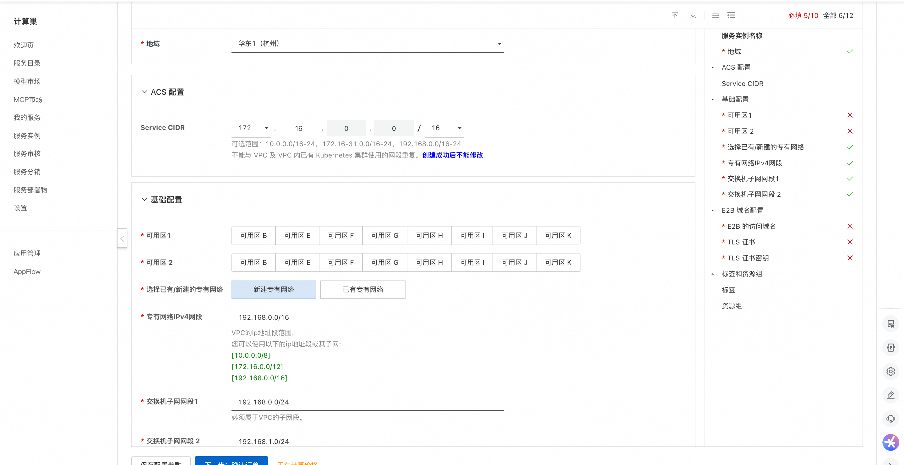
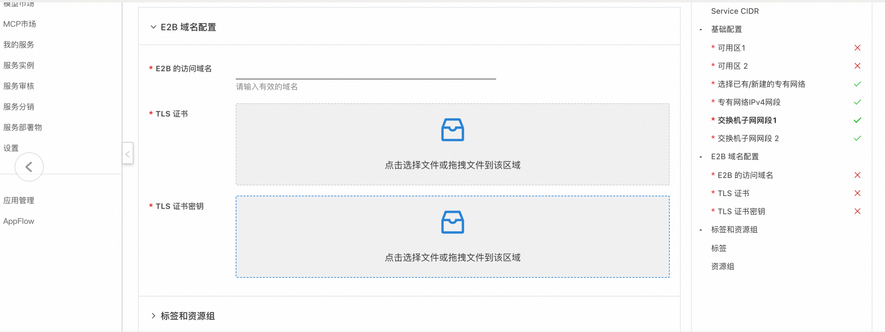
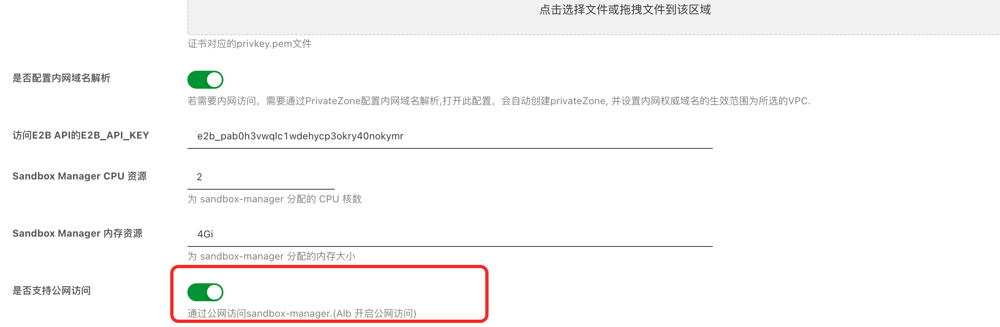
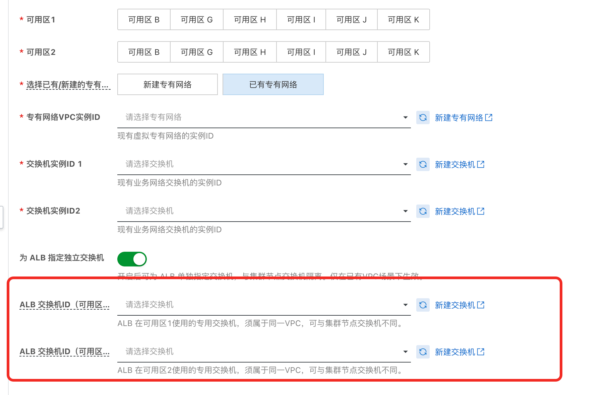
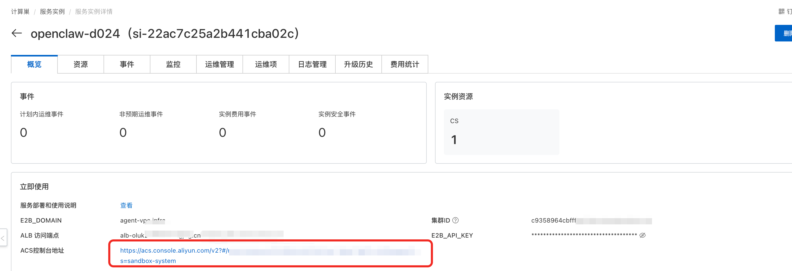
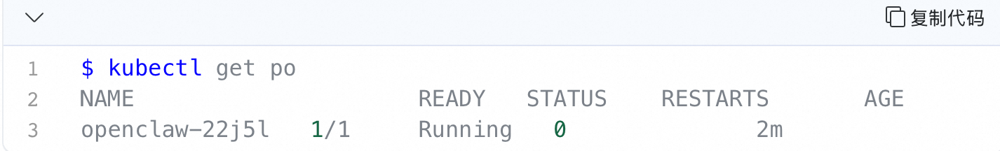
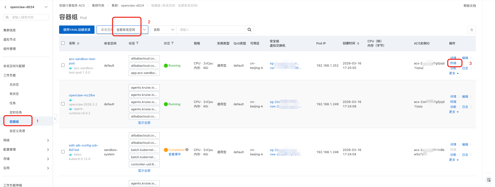
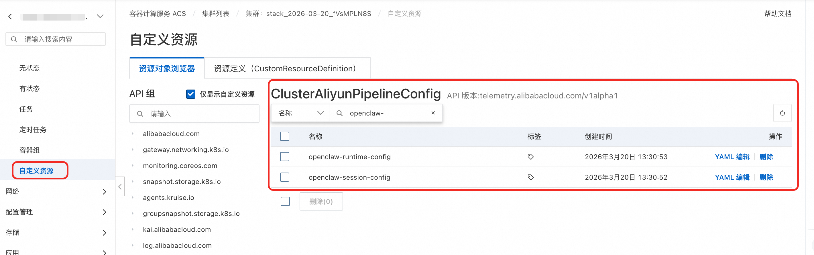
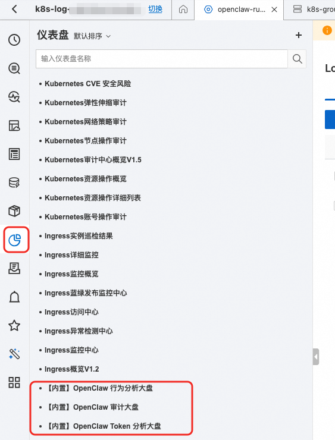

# 在ACS集群中使用 E2B 管理安全沙箱

## 概述

E2B 是一个流行的开源安全沙箱框架，提供了一套简单易用的 Python 与 JavaScript SDK 供用户对安全沙箱进行创建、查询、执行代码、请求端口等操作。 ack-sandbox-manager组件是一个兼容 E2B 协议的后端应用，使用户在任何 K8s 集群中一键搭建一个性能媲美原生 E2B 的沙箱基础设施。

本服务提供了在ACS 集群中快速搭建安全沙箱的解决方案，支持使用 E2B 协议进行交互。

## 前置准备

标准的 E2B 协议需要一个域名（E2B\_DOMAIN）来指定后端服务。为此，您需要准备一个自己的域名。 E2B 客户端必须通过 HTTPS 协议请求后端，因此还需要为服务申请一个通配符证书。

以下介绍了测试场景下的域名和证书准备步骤，生成的fullchain.pem和privkey.pem文件在后续部署环节会用到。

### 准备域名

*   测试场景中，为了方便验证，可以使用测试域名，比如示例：agent-vpc.infra。
    

### 获取自签名证书

通过脚本[generate-certificate.sh](https://github.com/openkruise/agents/blob/master/hack/generate-certificates.sh) 创建自签名证书, 您可以通过以下命令查看脚本的使用方法。

```plaintext
$ bash generate-certificates.sh --help

Usage: generate-certificates.sh [OPTIONS]

Options:
  -d, --domain DOMAIN     Specify certificate domain (default: your.domain.com)
  -o, --output DIR        Specify output directory (default: .)
  -D, --days DAYS         Specify certificate validity days (default: 365)
  -h, --help              Show this help message

Examples:
  generate-certificates.sh -d myapp.your.domain.com
  generate-certificates.sh --domain api.your.domain.com --days 730
```

生成证书的命令示例：

```plaintext
./generate-certificates.sh --domain agent-vpc.infra --days 730
```

完成证书生成后，您会得到以下文件：

*   fullchain.pem：服务器证书公钥
    
*   privkey.pem：服务器证书私钥
    
*   ca-fullchain.pem：CA 证书公钥
    
*   ca-privkey.pem：CA 证书私钥 该脚本会同时生成单域名（your.domain）与泛域名（\*.your.domain）证书，兼容原生 E2B 协议与 OpenKruise 定制 E2B 协议。
    
### 给RAM 用户授权

如果您使用的是RAM用户，需要授权RAM用户相关权限，才能够完成部署流程，参考[授权文档](https://help.aliyun.com/zh/compute-nest/security-and-compliance/grant-user-permissions-to-a-ram-user)
 
部署此服务需要的权限策略包括两个系统权限策略和一个自定义权限策略, 请联系有管理员权限的用户对RAM用户授予以下权限：
 **系统权限策略：**
- AliyunComputeNestUserFullAccess：管理计算巢服务（ComputeNest）的用户侧权限，
- AliyunROSFullAccess：管理资源编排服务（ROS）的权限。
 **自定义权限策略：**
- 测试环境权限策略：[policy_test.json](https://github.com/aliyun-computenest/openclaw-acs-sandbox/blob/main/docs/policy_test.json)
- 生产环境权限策略：[policy_prod.json](https://github.com/aliyun-computenest/openclaw-acs-sandbox/blob/main/docs/policy_prod.json)
 

## 部署流程

1.  打开计算巢服务[部署链接](https://computenest.console.aliyun.com/service/instance/create/cn-hangzhou?type=user&ServiceId=service-47d7c54c78604e0bbe79)
    
2.  填写相关部署参数、选择部署地域、ACS集群的Service CIDR, 专有网络配置
    
    
    
3.  填写E2B 域名配置，E2B的访问域名配置为上述前提准备阶段的域名，
    
    1.  TLS 证书选择fullchain.pem文件
        
    2.  TLS 证书私钥选择privkey.pem文件   
        
    
    
4.  会生成访问E2B API的 E2B\_API\_KEY
    
5.  sandbox-manager 组件默认的CPU和内存配置默认为2C, 4Gi, 可以按需调整

7. **ALB 配置**：支持以下两种模式：
   - **新建公网 ALB**（默认）：自动创建一个公网 ALB，适合快速验证场景。如果需要内网 ALB，请关闭公网访问开关。

   **为 ALB 指定独立交换机（VSW）**：默认情况下，ALB 会复用 ACS 集群所在的交换机。如果您希望 ALB 使用独立的交换机（例如生产环境中隔离网络流量），可以在 ALB 配置中指定独立的交换机 ID。指定独立 VSW 的注意事项

    
8. 配置完成后，点击确认订单
    
9. 部署成功后，在服务实例的详情页也可以查看E2B\_API\_KEY、E2B\_DOMAIN等信息 
    



## OpenClaw沙箱定义说明

计算巢默认 会通过以下 yaml 创建一个单副本的 OpenClaw SandboxSet预热池（相当于e2b的模版），后续如果自己构建了镜像，可以直接替换集群中的openclaw镜像。 若为了提升拉取速度，也可替换为内网镜像：registry-${RegionId}-vpc.ack.aliyuncs.com/ack-demo/openclaw:2026.3.2

```yaml
apiVersion: agents.kruise.io/v1alpha1
kind: SandboxSet
metadata:
  name: openclaw
  namespace: default
  annotations:
    e2b.agents.kruise.io/should-init-envd: "true"
  labels:
    app: openclaw
spec:
  persistentContents: 
  - filesystem
  replicas: 1
  template:
    metadata:
      labels:        
        alibabacloud.com/acs: "true" # 使用ACS算力
        app: openclaw
      annotations:
        ops.alibabacloud.com/pause-enabled: "true" # 支持pause
    spec:
      restartPolicy: Always
      automountServiceAccountToken: false #Pod 不挂载 service account
      enableServiceLinks: false #Pod 不注入 service 环境变量
      initContainers:
        - name: init
          image: registry-cn-hangzhou.ack.aliyuncs.com/acs/agent-runtime:v0.0.2
          imagePullPolicy: IfNotPresent
          command: [ "sh", "/workspace/entrypoint_inner.sh" ]
          volumeMounts:
            - name: envd-volume
              mountPath: /mnt/envd
          env:
            - name: ENVD_DIR
              value: /mnt/envd
            - name: __IGNORE_RESOURCE__
              value: "true"
          restartPolicy: Always
      containers:
        - name: openclaw
          image: registry-cn-hangzhou.ack.aliyuncs.com/ack-demo/openclaw:2026.3.2        
          imagePullPolicy: IfNotPresent
          securityContext:
            readOnlyRootFilesystem: false
            runAsGroup: 0
            runAsUser: 0
          resources:
            requests:
              cpu: 2
              memory: 4Gi
            limits:
              cpu: 2
              memory: 4Gi
          env:
            - name: ENVD_DIR
              value: /mnt/envd
            - name: DASHSCOPE_API_KEY 
              value: sk-xxxxxxxxxxxxxxxxx # 替换为您真实的API_KEY
            - name: GATEWAY_TOKEN 
              value: clawdbot-mode-123456 # 替换为您希望访问OpenClaw的token
          volumeMounts:
            - name: envd-volume
              mountPath: /mnt/envd            
          startupProbe:
            tcpSocket:
              port: 18789
            initialDelaySeconds: 5
            periodSeconds: 5
            failureThreshold: 30
          lifecycle:
            postStart:
              exec:
                command: [ "/bin/bash", "-c", "/mnt/envd/envd-run.sh" ]        
      terminationGracePeriodSeconds: 30  # 可以按照实际退出的速度来调整
      volumes:
        - emptyDir: { }
          name: envd-volume
```

**重要字段说明**

*   SandboxSet.spec.persistentContents: filesystem #在pause，connect的过程中只保留文件系统（不保留ip、mem）
    
*   template.spec.restartPolicy: Always
    
*   template.spec.automountServiceAccountToken: false #Pod 不挂载 service account
    
*   template.spec.enableServiceLinks: false #Pod 不注入 service 环境变量
    
*   template.metadata.labels.alibabacloud.com/acs: "true"
    
*   template.metadata.annotations.ops.alibabacloud.com/pause-enabled: "true" # 支持pause, connect 动作
    
*   template.spec.initContainer #下载并copy envd 的环境 ， 保留即可
    
*   template.spec.initContainers.restartPolicy: Always
    
*   template.spec.containers.securityContext.runAsNonRoot: true #Pod 使用普通用户启动
    
*   template.spec.containers.securityContext.privileged: false # 禁用特权配置
    
*   template.spec.containers.securityContext.allowPrivilegeEscalation: false
    
*   template.spec.containers.securityContext.seccompProfile.type.RuntimeDefault
    
*   template.spec.containers.securityContext.capabilities.drop: \[ALL\]
    
*   template.spec.containers.securityContext.readOnlyRootFilesystem: false
    

如果预期使用Pause，一定不要设置liveness/rediness的探针，避免在暂停期间的健康检查问题 必要的修改

*   registry-cn-hangzhou.ack.aliyuncs.com/acs/agent-runtime # 修改为所在地域的镜像，并且是内网镜像【目前，未来会自动注入】
    
*   registry-cn-hangzhou.ack.aliyuncs.com/ack-demo/openclaw:2026.3.2 # 替换为客户自己构建的镜像
    

机制的简要说明 通过在pod启动envd，来支持e2b sdk的服务端接口

通过kubectl 创建上述资源，SandboxSet创建完成后，可以看到1个沙箱已经处于可用状态： 



# 服务部署验证

部署完成后，会得到一个对应的ACS集群，ACS集群中在sandbox-system命名空间下有sandbox-manager的Deployment，用于管理沙箱。 通过以下流程验证E2B服务已经正常运行，并介绍沙箱使用Demo.
该部分分为自动化测试和手动测试可选其中一种测试步骤验证核心功能，两种测试方式验证的功能一致，均包含沙箱创建，休眠和重新连接部分。

##  自动化测试 (无需配置本地环境和域名解析，可用于快速验证)
1. 点击计算巢服务实例，找到实例内包含的acs的集群。
2. 点击集群容器组界面，找到acs-test-pod，点击终端登录
3. 测试创建OpenClaw 沙箱
    - 配置以下环境变量，为OpenClaw配置GATEWAY_TOKEN 以及访问百炼的API_KEY,若不执行此步骤，将会使用默认值
      GATEWAY_TOKEN的默认值为：clawdbot-mode-123456
      DASHSCOPE_API_KEY的默认值为：sk-****
   ```bash
     export GATEWAY_TOKEN=****
     export DASHSCOPE_API_KEY=****    
   ```
    - 执行 `python create_openclaw.py`
    - 等待脚本完成，得到SandboxId，服务就绪后说明OpenClaw 启动成功，可以访问对应沙箱的OpenClaw Web UI，参考[访问 OpenClaw Web UI](#访问-OpenClaw-Web-UI)
4. 测试创建、休眠、唤醒Openclaw 沙箱
    - 执行 `python test_openclaw.py`
    - 等待脚本验证所有功能通过

## 手动测试 (可选)

### 配置域名的解析
#### 本地配置Host: 用于快速验证

1.  获取ALB的访问端点：ack-sandbox-manager 集群中使用Alb作为Ingress，在服务实例详情页，可以找到ACS控制台的链接，点击链接查看sandbox-manager的网关，可以获取ALB的访问端点，如下图所示 
    
    
    
2.  获取Alb端点对应的公网地址：本地通过ping ALB的访问端点得到公网Ip `ping alb-xxxxxx`
    
3.  将ALB的公网地址和域名配置到本地host：`echo "ALB_PUBLIC_IP api.E2B_DOMAIN" >> /etc/hosts` 示例为： `xx.xxx.xx.xxx api.agent-vpc.infra`
    
4.  配置完Host后，无需配置DNS解析，在本地就可以管理E2B沙箱，具体使用方式，参考“使用沙箱demo”章节。
    

#### 配置DNS解析：用于生产环境

1.  获取ALB的访问端点： ack-sandbox-manager 集群中使用Alb作为Ingress，在服务实例详情页，可以到ACS控制台的链接，点击链接查看sandbox-manager的网关，可以获取ALB的访问端点，如下图所示 
    
2.  配置DNS解析： 请将Alb的访问端点 以 CNAME 记录类型解析到对应域名， 
    
3.  如需通过内网访问，可以通过PrivateZone 为E2B 添加内网域名。(如果部署时选择了新建VPC, 已经为您自动配置了PrivateZone，后续只需要添加解析记录)【可选】

4.  验证E2B服务是否正常运行：替换xxxx为您前面指定的域名，返回值2xx表示e2b服务已运行,如果是自行签发的证书，需要指定fullchain.pem；或通过配置环境变量使用您本地的证书 【该动作为创建sandbox的动作】e2b使用的可以请自行替换 “admin-987654321"-> 实际的key

```yaml
curl --cacert fullchain.pem -X POST --location "https://api.xxx/sandboxes" \
    -H "Content-Type: application/json" \
    -H "X-API-Key: admin-987654321" \
    -d '{
          "templateID": "openclaw",
          "timeout": 300
        }'
```
当返回结果的json中，存在 "sandboxID" 且 "state":"running"，可以认为E2B 服务已经正常运行，且在本地可以访问E2B服务

5. 测试连通性之后，在本地就可以管理E2B沙箱，具体使用方式，参考“使用沙箱demo”章节。

### 使用沙箱demo

1. 安装 E2B Python SDK

```bash
pip install e2b-code-interpreter
```

2. 初始化客户端运行环境配置

```bash
export E2B_DOMAIN=your.domain
export E2B_API_KEY=your-token
# 如果使用了自签名证书，还需要配置可信CA证书
export SSL_CERT_FILE=/path/to/ca-fullchain.pem
```

> 将 `your.domain` 替换为部署时配置的 E2B 域名，`your-token` 替换为服务实例详情页的 E2B_API_KEY。

#### 创建沙箱并配置用户信息

为用户配置的OpenClaw的GATEWAY_TOKEN 以及访问百炼的API_KEY,
   ```bash
     export GATEWAY_TOKEN=****
     export DASHSCOPE_API_KEY=****    
   ```
为用户申请 Sandbox，并在 Sandbox 中配置个人信息。以下代码会读取 [openclaw_template.json]() 配置模板，注入用户独立的 token 和 LLM 鉴权信息。

```python
   # Import and patch the E2B SDK
    import os
    import requests
    from string import Template
    from e2b_code_interpreter import Sandbox
    
    # 注意为用户配置 never timeout
    sbx: Sandbox = Sandbox.create(template="openclaw-sbs", metadata={
                                   "e2b.agents.kruise.io/never-timeout": "true"
                                 })
    print(f"sandbox id: {sbx.sandbox_id}")
    
    # 基于环境变量中的 GATEWAY_TOKEN, DASHSCOPE_API_KEY, EXTERNAL_ACCESS_DOMAIN 读取
    GATEWAY_TOKEN = os.environ.get("GATEWAY_TOKEN", "clawdbot-mode-123456")
    DASHSCOPE_API_KEY = os.environ.get("DASHSCOPE_API_KEY", "sk-****")
    
    
    #渲染 openclaw-template.json 文件， 并将渲染后的文件覆盖沙盒中 /root/.openclaw/openclaw.json 的内容，触发openclaw重启更新配置
    template_path = "openclaw_template.json"
    with open(template_path, "r") as f:
        template_content = f.read()
    
    rendered_content = Template(template_content).safe_substitute(
        GATEWAY_TOKEN=GATEWAY_TOKEN,
        DASHSCOPE_API_KEY=DASHSCOPE_API_KEY,
    )
    
    sbx.files.write("/root/.openclaw/openclaw.json", rendered_content)
    print("已将渲染后的配置写入沙盒 /root/.openclaw/openclaw.json")
    print(f"sandbox: {sbx}")
    print(f"sandbox id: {sbx.sandbox_id}")
```

执行代码可以得到创建后返回的Sandbox对象，获取新创建Sandbox对象的详细信息

```python
print(f"sandbox: {sbx}")
print(f"sandbox id: {sbx.sandbox_id}")
> 创建后返回的 Sandbox 对象中包含新创建 Sandbox 的详细信息。sandbox id 的命名格式为 `{Namespace}--{Sandbox Name}`，其中 `--` 之前为对应资源所处的 K8s 命名空间，之后为 Sandbox 的名称。

#### 休眠与唤醒

当用户长时间不使用时，可以将对应 Sandbox 挂起，触发沙箱休眠。休眠期间，沙箱中文件系统等状态被冻结，ACS 不会收取 CPU、Memory 资源的费用，只会产生少量的存储成本。

```python
from e2b_code_interpreter import Sandbox

# 通过 sandbox ID 连接到已存在的 sandbox
sandbox_id = "default--openclaw-52xbx"  # 替换为你的实际 sandbox ID
# 注意根据申请时的申请信息，配置timeout时间
sbx = Sandbox.connect(sandbox_id, timeout=2592000)

# 挂起Sandbox
sbx.beta_pause()

input("press ENTER to step")

# 恢复被挂起的Sandbox，注意timeout配置
sbx.connect(timeout=2592000)
```

> 沙箱休眠成功后，沙箱的状态会变成休眠状态，对应的 Pod 也会消失。注意沙箱实例休眠期间，OpenClaw 服务将处于不可访问状态。

## 访问 OpenClaw Web UI

创建并配置好 Sandbox 后，可以通过以下方式访问 OpenClaw Web UI.

**注意**：通过create_openclaw.py创建的sandbox才可以直接访问，sandboxset里的预热的sandbox无法直接访问，请参考create_openclaw里创建sandbox

### 域名格式说明

OpenClaw 沙箱通过 PrivateZone 泛域名解析 + ALB 路由实现访问，域名格式为：
`https://<port>-<namespace>--<pod-name>.<e2b-domain>?token=<gateway-token>
                 ↑↑
              双连字符（重要！）`

**参数说明：**
- `port`: OpenClaw Web UI 端口，固定为 `18789`
- `namespace`: Pod 所在命名空间，默认为 `default`
- `pod-name`: Sandbox Pod 名称，如 `openclaw-abc12`
- `e2b-domain`: 部署时配置的 E2B 域名，如 `agent-vpc.infra`
- `gateway-token`: SandboxSet 中配置的 `GATEWAY_TOKEN` 环境变量值

**示例 URL：**
```
https://18789-default--openclaw-abc12.agent-vpc.infra?token=clawdbot-mode-123456
```

> ⚠️ **注意**：namespace 和 pod-name 之间必须使用**双连字符 `--`**，这是 PrivateZone 域名解析的规范格式。使用单连字符会导致 502 错误。

### 获取 Sandbox Pod 名称

通过以下命令获取可用的 OpenClaw Sandbox Pod，或直接在控制台查看：

```bash
kubectl get pods -n default -l app=openclaw
```

输出示例：
```
NAME             READY   STATUS    RESTARTS   AGE
openclaw-abc12   2/2     Running   0          10m
openclaw-def34   2/2     Running   0          15m
```

### 本地访问配置

由于 PrivateZone 域名只在 VPC 内生效，本地访问需要配置 hosts 文件：

**步骤 1：获取 ALB 公网 IP**

在 testpod 执行 `dig ${alb_domain}`，其中 `alb_domain` 可在计算巢服务实例界面处看到：


**步骤 2：配置 hosts 文件**

将 ALB 公网 IP 和沙箱域名添加到 `/etc/hosts`：

```bash
# macOS/Linux
sudo vim /etc/hosts

# 添加以下内容（替换为实际的 ALB IP 和 Pod 名称）
39.103.89.43 18789-default--openclaw-abc12.agent-vpc.infra
39.103.89.43 18789-default--openclaw-def34.agent-vpc.infra
```

**步骤 3：浏览器访问**

在浏览器中打开（需要接受自签名证书警告）：

```
https://18789-default--openclaw-abc12.agent-vpc.infra?token=clawdbot-mode-123456
```


## 可观测能力
### OpenClaw 日志
SLS k8s原生能力在ACS集群内通过alibaba-log-controller组件提供，通过CR的方式创建采集配置，对应的CRD资源名为ClusterAliyunPipelineConfig。



SLS提供开箱即用的OpenClaw采集配置，可以通过SLS控制台访问OpenClaw日志，对应的SLS的Project为k8s-log-${acs集群id},
- OpenClaw Runtime日志（网关 / 应用）
  - 对应的 logstore 为 openclaw-runtime
  - 对应的采集配置为 openclaw-runtime-config
  - 对应的K8s集群中的CR名为 openclaw-runtime-config
- OpenClaw Session 审计日志
  - 对应的 logstore 为 openclaw-session
  - 对应的采集配置为 openclaw-session-config
  - 对应的K8s集群中的CR名为 openclaw-session-config

针对OpenClaw日志，SLS内置仪表盘覆盖安全审计、成本分析、行为分析三个维度:
- OpenClaw 行为分析大盘: 对 OpenClaw 的运行行为进行全量记录与分类统计
- OpenClaw 审计大盘: 从行为总览、高危命令、提示词注入、数据外泄等维度展开，提供实时行为监控、威胁识别与事后溯源的完整能力
- OpenClaw Token 分析大盘: 从整体概览、模型维度趋势、会话等维度展开，提供用量监控、成本分析与异常发现能力



注意：
内置采集配置仅针对demo镜像，自定义镜像的日志路径、容器过滤条件等可能有所不同，可以在ACS集群内通过修改对应的CR进行配置修正。
